# Java面试

## 一、 JVM

### 1. 平台无关性

```
Java源码（.java）首先被编译成字节码（.class)，再由不同平台的JVM进行解析，Java语言在不同的平台上运行时不需要进行重新编译，Java虚拟机在执行字节码的时候，把字节码转换成具体平台上的机器指令。
```


#### 2. 类加载机制

#### 2.1 Java运行时数据区



- **Class Loader**：依据特定格式，加载Class文件到内存
- **Execution Engine**：对命令进行解析
- **Native Interface**：融合不同开发语言的原生库为Java所用
- **Runtime Data Area**：JVM内存空间结构模型

#### 2.2 反射

1. 概念

Java反射是在运行状态中，对于任意一个类，都能够知道这个类的所有的属性和方法，对于任意一个对戏那个，都能够调用它的所有属性和方法，这种动态获取信息以及动态调用对象方法的功能称为Java语言的反射机制。

2. 常用对象

- `Class`

```
Class类实例表示正在运行的Java应用程序中的类和接口
```

- `Constructor`

```
关于类的单个构造方法的信息以及对它的访问权限
```

- `Field`

```
Field提供有关类或接口的单个字段信息，以及对它的动态访问权限
```

- `Method`

```
Method类提供关于类或接口上单独某个方法的信息
```

3. API

- 获取Class对象

> 1. 已知类和对象的情况下
>
> ```
> 类名.class
> 对象名.getClass
> ```
>
> 2. 未知类和对象的情况下
>
> ```
> Class.forName("包名.类名")（推荐）
> ```

- Constructor类

> 1. 得到某个类的所有构造方法
>
> ```java
> Constructor[] constructors = Class.forName(Java.lang.String).getConstructors();
> ```
>
> 2. 得到指定的构造方法并调用
>
> ```java
> Constructor constructor = Class.forName("java.lang.String").getConstructor(String.class)
> String str = constrctor.newInstance("abc");
> ```
>
> 3. Class类的getInstance()用来调用类的默认构造方法
>
> ```java
> String obj = Class.forName("java.lang.String").newInstance();
> ```

- Field类

> 1. 得到所有的成员变量
>
> ```java
> // 获取所有的public属性，包括父类继承
> Field[] fields = c.getField();
> // 或得所有声明的属性
> Field[] fields = c.getDeclaredField(); 
> ```
>
> 2. 获取指定的成员变量
>
> ```java
> // 共有属性
> Field field = c.getField("name");
> // 任何属性
> Field field = c.getDeclardField("name");
> ```
>
> 3. 设置field变量是否可以访问
>
> ```java
> // 默认是false
> field.setAccessible(true);
> ```
>
> 4. field变量的读取、设置
>
> ```java
> field.get(obj);
> field.set(obj, val);
> ```

- Method类

> 1. 获得所有方法
>
> ```java
> // 获得所有的共有成员方法
> getMethods()
> // 获得所有声明的成员方法
> getDeclaredMethod()
> ```
>
> 2. 获得指定的方法
>
> ```java
> getMethod(String name, Class<?>...parameterTypes);
> getDeclaredMethod(String name, Class<?>...parameterTypes);
> ```
>
> 3. 通过反射执行方法
>
> ```java
> invoke(Object obj, Object...args);
> ```

4. 反射举例

```java
public class Robot {
    private String name;

    public void sayHello2Sb(String sb) {
        System.out.println("Hello, " + sb + "!");
    }

    private String whoAmI() {
        return "I'm " + name;
    }
}
```

```java
public class ReflectSample {
    public static void main(String[] args) throws ClassNotFoundException, NoSuchMethodException, IllegalAccessException, InvocationTargetException, InstantiationException, NoSuchFieldException {
        // 获取class对象
        Class robotClazz = Class.forName("com.interview.reflect.Robot");
        System.out.println("Class name is: " + robotClazz.getName());

        // 获取构造方法进行实例化
        Robot robot = (Robot)robotClazz.getConstructor().newInstance();

        // 获取并调用公有方法sayHello2Sb
        Method getSayHello = robotClazz.getMethod("sayHello2Sb", String.class);
        getSayHello.invoke(robot,"Ann");

        // 获取并设置私有属性name
        Field filed = robotClazz.getDeclaredField("name");
        filed.setAccessible(true);
        filed.set(robot, "Bob");

        // 获取并调用私有方法whoAmI
        Method getWho = robotClazz.getDeclaredMethod("whoAmI");
        getWho.setAccessible(true);
        String myName = (String)getWho.invoke(robot);
        System.out.println("My name is: " + myName);
    }
}
```

总结：反射就是把java类中的成分映射成一个个的对象

#### 2.3 类加载机制

