# Linux基础

## 一、Linux常用命令

### 1. 命令格式

```shell
命令 [-选项] [参数]
```

例如

```shell
ls -a /etc
```

（1）个别命令使用不遵循此格式

（2）当有多个选项时可以写在一起

（3）简化选项与完整选项 -a = --all

### 2. 目录处理命令

#### 2.1 `ls`

```
命令名称：ls
命令英文原意：list
命令所在路径：/bin/ls
执行权限：所有用户
功能描述：显示目录文件
语法：ls 选项[-ald] 文件或目录
​	-a 显示所有文件
​	-l 详细信息显示
​	-d 查看目录属性
​	-i 查看i节点
```

- `ls -l` 长格式显示


```shell
# 文件类型及权限 引用计数 所有者 所属组 文件大小 最后修改时间 文件名
```

- `-rw-rw-r--` 文件类型及权限

```
-文件类型
        -(二进制文件)
        d(目录)
        l(软连接文件)
​rw- rw- r--
	u(所有者) g(所属组) o(其他人)
	r(读)    w(写)	 x(执行)
```

#### 2.2 `mkdir`

```
命令名称：mkdir
命令英文原意：make directories
命令所在路径：/bin/mkdir
执行权限：所有用户
语法：mkdir -p [目录名]
​		-p 递归创建
功能描述：创建目录
```

例如：

```shell
mkdir -p /tmp/learn/java
mkdir /tmp/learn/java/spring
```

#### 2.3 `cd`

```
命令名称：cd
英文原意：change directory
命令所在路径：shell内置命令
执行权限：所有用户
语法：cd [目录]
功能描述：切换目录
```

例如：

```shell
# 切换到指定目录
cd /tmp/learn/java
# 回到上一级目录
cd ..
```

#### 2.4 `pwd`

```
命令名称：pwd
命令原意：print working directory
命令所在路径：/bin/pwd
执行权限：所有用户
语法：pwd
功能描述：显示当前目录
```

例如：


#### 2.5 `rmdir`

```
命令名称：rmdir
命令英文原意：remove empty directories
命令所在路径：/bin/rmdir
执行权限：所有用户
语法：rmdir [目录]
功能描述：删除空目录
```

例如：

```shell
rmdir /tmp/learn/java/spring
```

#### 2.6 `cp`

```
命令名称：cp
命令英文原意：copy
命令所在路径：/bin/cp
执行权限：所有用户
语法：cp -rp [原文件或目录] [目标目录]
​		-r 复制目录
​		-p 保留文件属性
功能描述：复制文件或目录
```

例如：

```shell
# 复制目录
cp -r ~/dev/ /tmp
# 复制多个文件
cp /tmp/linux_cp.txt /tmp/linux_cp2.txt /tmp/learn/java/
# 保留文件属性
cp -p linux_cp.txt /tmp/learn/frame/
# 复制目录并更名
cp -r ~/dev/ /tmp/myDev/
```

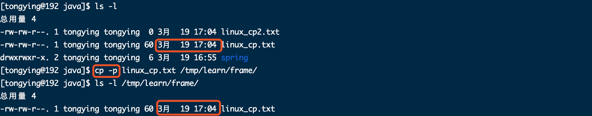

#### 2.7 `mv`

```
命令名称：mv
命令英文原意：move
命令所在路径：/bin/mv
执行权限：所有用户
语法：mv [原文件或目录] [目标目录]
功能描述：剪切文件、改名
```

例如：

```shell
# 剪切目录与剪切文件一样，不需要-r
mv myDir /tmp
# 剪切并更名
mv /tmp/myDir ~/newDir
```

#### 2.8 `rm`

```
命令名称：rm
命令英文原意：remove
命令所在路径：/bin/rm
执行权限：所有用户
语法：rm -rf [文件或目录]
​		-r 删除目录
​		-f 强制删除
功能描述：删除文件
```

### 3. 文件处理命令

#### 3.1 `touch`

```
命令名称：touch
命令所在路径：/bin/touch
执行权限：所有用户
语法：touch [文件名]
功能描述：创建空文件
```

例如：

```shell
# 创建文件
touch /tmp/list.txt
# 同时创建hello和world两个文件
touch hello world
# 不推荐文件名包含空格，如果一定要用，加双引号
touch "hello world"
```

#### 3.2 `cat`

```
命令名称：cat
命令所在路径：/bin/cat
执行权限：所有用户
语法：cat [文件名]
功能描述：显示文件内容
​		-n 显示行号
```

例如：

```shell
touch -n list.txt
```

#### 3.3 `tac`

```
命令名称：tac
命令所在路径：/usr/bin/tac
执行权限：所有用户
语法：tac [文件名]
功能描述：显示文件内容（反向列示）
备注：cat倒过来写
```

例如：

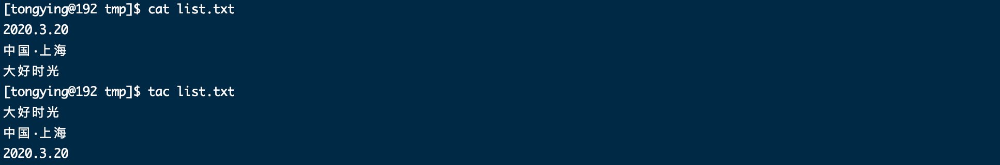

#### 3.4 `more`

```
命令名称：more
命令所在路径：/bin/more
执行权限：所有用户
语法：more [文件名]
​		空格或f 翻页
​		Enter  换行
​       q或Q   退出
功能描述：分页显示文件内容
```

例如：

```shell
more /etc/services
```

#### 3.5 `less`

```
命令名称：less
命令所在路径：/usr/bin/less
执行权限：所有用户
语法：less [文件名]
功能描述：分页显示文件内容（可向上翻页）
​		向上翻页：Page Up
​		向下翻页：Page Down或Space或f
​		上翻：Up
​		下翻：Down或Enter
​		搜索：/（查找下一个搜索内容 n）		
```

例如：

```shell
less /etc/services
```

#### 3.6 `head`

```
命令名称：head
命令所在路径：/usr/bin/head
执行权限：所有用户
语法：head [文件名]
功能描述：显示文件前面几行
​		-n+行数 显示前面几行
备注：不加参数默认显示前10行
```

例子：

```shell
# 显示前5行
head -n 5 list.txt
```

#### 3.7 `tail`

```
命令名称：tail
命令所在路径：/usr/bin/tail
执行权限：所有用户
语法：tail [文件名]
功能描述：显示文件后面几行
​		-n 指定行数
​		-f 动态显示文件末尾内容
```

例子：

```shell
# 显示后面5行
tail -n 5 list.txt
# 动态显示Tomcat日志
tail -f catalina.out
```

### 4. 链接命令

#### 4.1 `ln`

```
命令名称：ln
命令英文原意：link
命令所在路径：/bin/ln
执行权限：所有用户
语法：ln -s [原文件] [目标文件]
​		-s 创建软链接
功能描述：生成链接文件
```

例子：

```shell
# 创建软链接文件
ln -s /tmp/poem poem.soft
# 创建硬链接文件
ln /tmp/poem poem.hard
```

- **软链接特征——类似windows快捷方式**

（1）`lrwxrwxrwx`，l标识软链接文件，其权限都为rwxrwxrwx

（2）软连接文件通常比较小，只是符号链接

（3）`poem -> /tmp/poem`，箭头指向原文件


- **硬链接特征**

（1）保留文件属性拷贝`cp -p` + 同步更新

（2）通过i节点识别

（3）不能跨分区

（4）不能针对目录使用

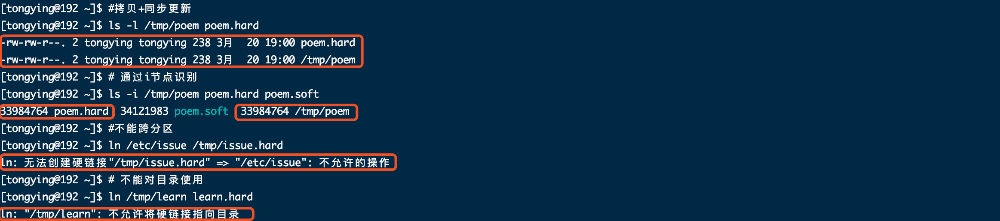

**删除原文件后对链接文件有什么影响？**

（1）软链接文件也被删除

（2）硬链接没有影响

### 5. 权限管理命令

#### 5.1 `chmod`

```
命令名称：chmod
命令英文原意：change permission mode of a file
命令所在路径：/bin/chmod
执行权限：所有用户
语法：chmod [{ugoa}{+-=}{rwx}] [文件或目录]
	 chmod [mode=421] [文件或目录]
​	 -R 递归修改
功能描述：改变文件或目录权限
```

例如：

```shell
# 赋予文件所属组写权限
chmod g+w testfile
# 同时修改多个权限用逗号分隔
chmod g+w,o-w testfile
# 修改目录testdir及其目录下所有文件权限为rwxrwxrwx
chmod -R 777 testdir
```

- **文件目录权限总结**

  | 代表字符 | 权限 | 对文件的含义     | 对目录的含义               |
  | -------- | ---- | ---------------- | -------------------------- |
  | r        | 读   | 可以查看文件内容 | 可以列出目录中的内容       |
  | w        | 写   | 可以修改文件内容 | 可以在目录中创建、删除文件 |
  | x        | 执行 | 可以执行文件     | 可以进入目录               |

  对文件来说，r权限是其最基本的权限。

  对目录来说，x权限是其最基本的权限。

- **root用户创建了一个权限为777的目录，并在目录下创建一个新的文件，其他用户是否能删除该文件？**

```
能。
创建、删除文件与该文件所在目录的权限有关（w权限）。
```

#### 5.2 `chown`

```
命令名称：chown
命令英文原意：change file ownership
命令所在路径：/bin/chown
执行权限：root
语法：chown [用户名] [文件或目录]
功能描述：改变文件或目录的所有者
```

例如：

```shell
# 改变hello.java的所有者为tom
chown tom hello.java
```

#### 5.3 `chgrp`

```
命令名称：chgrp
命令英文原意：change file group owership
命令所在路径：/bin/chgrp
执行权限：root
语法：chgrp [用户组] [文件或目录]
功能描述：改变文件或目录的所属组
```

例如：

```shell
# 改变文件hello.java的所属组为mallgoup
chgrp mallgroup hello.java
```

#### 5.4 `umask`

```
命令名称：umask
命令英文原意：the user file-creation mask
命令所在路径：Shell内置命令
执行权限：所有用户
语法：umask [-S]
		-S 以rwx形式显示新建文件缺省权限
功能描述：显示、设置文件的缺省权限
```

例如：

（1）显示新建文件的缺省权限


rwxrwxr-x = 775 = 777 - 002

（2）设置新建文件的缺省权限

```shell
# rwxr-xr-x = 755 = 777 - 022
umask 022
```

- **为什么设置的缺省权限为002（rwxrwxr-x），新建文件的权限却为rw-rw-r?**

```
规定：缺省创建的文件是不能具有可执行权限的，出于安全考虑。
```

### 6. 文件搜索命令

#### 6.1 `find`

```
文件搜索命令：find
命令所在路径：/bin/find
执行权限：所有用户
语法：find [搜索范围] [匹配条件]
功能描述：文件搜索
```

（1）按文件名查找

- `-name` 严格区分大小写
- `-iname` 不区分大小写

```shell
# 严格区分大小写
find /etc -name init
# 不区分大小写
find /etc -iname init
# "*"匹配任意字符
find /etc -name *init*
# "?"匹配单个字符
find /etc -name init???
```

（2）按文件大小查找`-size`

- `-size +n` 查找大于n个数据块的文件
- `-size -n` 查找小于n个数据块的文件
- `-size n` 查找等于n个数据块的文件

```shell
# 在根目录下查找大于100M的文件
find / -size +204800
# 在根目录下查找小于80M的文件
find / -size -163840
# 在根目录下查找等于100M的文件
find / -size 204800
# 一个数据块 = 512B
# 100MB = 102400KB = 204800个数据块
# 80MB = 81920KB = 163840个数据块
```

（3）按所有者或所属组查找`-user/-group`

- `-user` 按所有者查找
- `-group` 按所属组查找

```shell
# 在/home目录下查找所有者为tom的文件
find /home -user tom
# 在/home目录下查找所属组为testgrp的文件
find /home -group testgrp
```

（4）按时间查找

- `-amin` 按访问时间查找 access
- `-cmin` 按文件属性修改时间查找 change
- `-mmin` 按文件内容修改时间查找 modify 

```shell
# 在/etc下查找5分钟内被修改过属性的文件目录
find /etc -cmin -5
```

（5）按文件类型查找

- `-type f` 查找类型为文件
- `-type d` 查找类型为目录
- `-type l` 查找类型为软链接

（6）按i节点查找

- `inum` 根据i节点查找（可以用来判断文件是否有硬链接）


（7）匹配多个条件

- `-a` 多个条件同时满足
- `-o` 多个条件满足任意一个即可

```shell
# 在/etc下查找大于80MB并且小于100MB的文件
find /etc -size +163840 -a -size -204800
# 在根目录下查找>80MB并且<100MB并且一个小时内访问过的文件
find /etc -size +163840 -a -size -204800 -a -amin -60
```

（8）对搜索结果执行操作

- `-exec/-ok command {} \;` 对搜索结果进行command操作

```shell
# 在/etc目录下查找名为inittab的文件并显示其详细信息
find /etc -name inittab -exec ls -l {} \;
```


#### 6.2 `locate`

```
命令名称：locate
命令所在路径：/usr/bin/locate
执行权限：所有用户
语法：locate 文件名
		-i 不区分大小写
功能描述：在文件资料库中查找文件
locate文件资料库所在目录：/var/lib/mlocate/mlocate.db
备注：locate可能需要安装，文件资料定期更新
```

（1）新创建的文件还未被更新到文件资料库中可能会查找不到

```shell
# 更新文件资料库
updatedb
```

（2）有些目录不在文件资料库的收录范围，如/tmp


#### 6.3 `which`

```
命令名称：which
命令所在路径：/usr/bin/which
执行权限：所有用户
语法：which 命令
功能描述：搜索命令所在目录及别名信息
```

例如：


#### 6.4 `whereis`

```
命令名称：whereis
命令所在路径：/usr/bin/whereis
执行权限：所有用户
语法：whereis [命令名称]
功能描述：搜索命令所在路径及帮助文档所在路径
```

例如：


#### 6.5 `grep`

```
命令名称：grep
命令所在路径：/bin/grep
执行权限：所有用户
语法：grep -iv [指定字串] [文件]
功能描述：在文件中搜寻字串匹配的行并输出
		-i 不区分大小写
		-v 排除指定字串
```

例子：

```shell
grep mysql /root/install.log
```

```python
# /tmp/hello.py
# 输出Hello world
print("Hello World)
```


### 7. 帮助命令

#### 7.1 `man`

```
命令名称：man
命令英文原意：manual
命令所在路径：/usr/bin/man
执行权限：所有用户
语法：man [命令或配置文件]
功能描述：获得帮助信息
```

例如：

```shell
# 查看ls命令的帮助信息
man ls
# 查看配置文件service的帮助信息，注意不能用配置文件的绝对路径
man services
```

（1）命令和配置文件同名时，默认查看的是命令的帮助信息

```shell
# 1——命令的帮助
# 5——配置文件的帮助
# 查看passwd命令的帮助信息
man [1] passwd
# 查看passwd配置文件的帮助信息
man 5 passwd
```

（2）`what’s 命令名称` 可以查看命令的简短介绍


（3）`apropos 配置文件` 可以查看配置文件的简短介绍

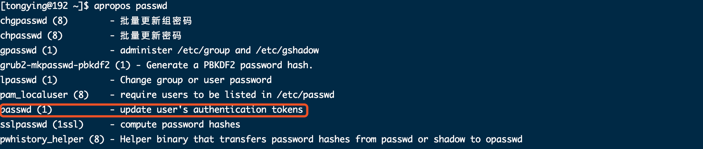

（4）`命令 --help` 可以列出命令的常见选项

（5）`info 命令名称` 也可以获得命令的帮助信息，与`man`类似，只是显示有差异

#### 7.2 `help`

```
命令名称：help
命令所在路径：Shell内置命令
执行权限：所有用户
语法：help 命令
功能描述：获得Shell内置命令的帮助信息
```

例如：

```shell
# 查看umask命令的帮助信息
help umask
```

### 8. 用户管理命令

#### 8.1 `useradd`

```
命令名称：useradd
命令所在路径：/usr/sbin/useradd
执行权限：root
语法：useradd 用户名
功能描述：添加新用户
```

例如：

```shell
useradd tom
```

#### 8.2 `passwd`

```
命令名称：passwd
命令所在路径：/usr/bin/passwd
执行权限：所有用户
语法：passwd 用户名
功能描述：设置用户密码
```

例如：

```shell
passwd tom
```

#### 8.3 `who`

```
命令名称：who
命令所在路径：/usr/bin/who
执行权限：所有用户
语法：who
功能描述：查看登陆用户信息
```

（1）显示格式

```
登陆用户名 登陆终端 登陆时间 IP地址
```

​		tty——本地终端

​		pts——远程终端

例如：


#### 8.4 `w`

```
命令名称：w
命令所在路径：/usr/bin/w
执行权限：所有用户
功能描述：查看登陆用户详细信息
```

例如：


显示格式：

```
(1)10:44:00——系统当前时间
(2)up 1 day, 23:32——系统连续运行时间
(3)3 users——登录用户数量
(4)load average: 0.00, 0.02, 0.05——负载均衡指数(1min, 5min, 15min)
(5)USER——登录用户
(6)TTY——登录终端
(7)FROM——IP
(8)LOGIN@——登录时间
(9)IDLE——用户空闲时间
(10)JCPU——与该终端连接的所有进程累计占用的时间
(11)PCPU——当前进程所占用的CPU时间
(12)WHAT——当前执行的命令
```

Linux连续运行时间查看：

```shell
uptime
```


### 9. 压缩解压缩命令

#### 9.1 `gzip`

```
命令名称：gzip
命令英文原意：GNU zip
命令所在路径：/bin/gzip
执行权限：所有用户
语法：gzip [文件]
功能描述：压缩文件
压缩后格式：.gz
```

- 只能压缩文件，不能压缩目录
- 压缩后不保留原文件

#### 9.2 `gunzip`

```
命令名称：gunzip
命令英文原意：GNU unzip
命令所在路径：/bin/unzip
执行权限：所有用户
语法：gunzip [压缩文件]
功能描述：解压缩.gzip的压缩文件
```

例如：


#### 9.3 `tar`

``` 
命令名称：tar
命令所在路径：/bin/tar
执行权限：所有用户
语法：tar 选项[-zcf] [压缩后文件名] [目录]
		-c 打包
		-v 显示详细信息
		-f 指定文件名
		-z 打包同时压缩
功能描述：打包目录
压缩后文件格式：.tar.gz
```

例如：

```shell
# 将java目录打包并压缩
tar -zcf java.tar.gz java
```


tar命令解压缩语法：

```
-x 解包
-v 显示详细信息
-f 执行解压文件
-z 解压缩
```

例如：

```shell
tar -zxvf java.tar.gz
```

#### 9.4 `zip`

```
命令名称：zip
命令所在路径：/usr/bin/zip
执行权限：所有用户
语法：zip 选项[-r] [压缩后文件名] [文件或目录]
		-r 压缩目录
功能描述：压缩文件过目录
压缩后文件格式：.zip
```

例如：

```shell
# 压缩文件Cat.java
zip Cat.zip Cat.java
# 压缩目录java
zip java.zip java
```

#### 9.5 `unzip`

```
命令名称：unzip
命令所在路径：/usr/bin/unzip
执行权限：所有用户
语法：unzip [压缩文件]
功能描述：解压.zip的压缩文件
```

例如：

```shell
unzip java.zip
```

#### 9.6 `bzip2`

```
命令名称：bzip2
命令所在路径：/usr/bin/bzip2
执行权限：所有用户
语法：bzip2 选项[-k] [文件]
		-k 产生压缩文件后保留原文件
功能描述：压缩文件
压缩后文件格式：.bz2
```

- gzip的升级版，压缩比例更高，能保留原文件
- 压缩目录可使用`tar -cjf`

例如：

```shell
# 将文件grobbs压缩成grobbs.bz2
bzip2 -k grobbs
# 将目录java压缩成java.tar.bz2
tar -cjf java.tar.bz2 java
```

#### 9.7 `bunzip2`

```
命令名称：bunzip2
命令所在路径：/usr/bin/bunzip2
执行权限：所有用户
语法：bunzip2 选项[-k] 压缩文件
		-k 解压后保留原文件
功能描述：解压缩
```

例如：

```shell
bunzip2 -k groobs.bz2
tar -xjf java.tar.bz2
```

### 10. 网络命令

#### 10.1 `write`

```
命令名称：write
命令所在路径：/usr/bin/write
执行权限：所有用户
语法：write <用户名>
功能描述：给在线用户发信息，以CTRL+D保存结束
```

例如：


#### 10.2 `wall`

```
命令名称：wall
命令英文原意：write all
命令所在路径：/usr/bin/all
执行权限：所有用户
语法：wall [message]
功能描述：发广播信息
```

例如：


所有在线用户都能收到信息，包括自己

#### 10.3 `ping`

```
命令名称：ping
命令所在路径：/bin/ping
执行权限：所有用户
语法：ping 选项 IP地址
		-c 指定发送次数
功能描述：测试网络连通性
```

例如：


#### 10.4 `ifconfig`

```
命令名称：ifconfig
命令英文原意：interface configure
命令所在路径：/usr/sbin/ifconfig
语法：ifconfig 网卡名称  IP地址
执行权限：root用户
功能描述：查看和设置网卡信息
```

- CentOS7默认没有安装这个命令`-bash: ifconfig: 未找到命令`

```shell
sudo yum -y install net-tools
```

例如：

```shell
ifconfig eth0 192.168.124.50
```

#### 10.5 `mail`

```
命令名称：mail
命令所在路径：/bin/mail
执行权限：所有用户
语法：mail [用户名]
功能描述：查看和发送邮件
```

例如：

```shell
# 给tom发送邮件
mail tom
# 读邮件
mail
```

#### 10.6 `last`

```
命令名称：last
命令所在路径：/usr/bin/last
执行权限：所有用户
语法：last
功能描述：列出目前与过去登录过系统的用户信息
```

- 可以查看计算机是否重启过

例如：

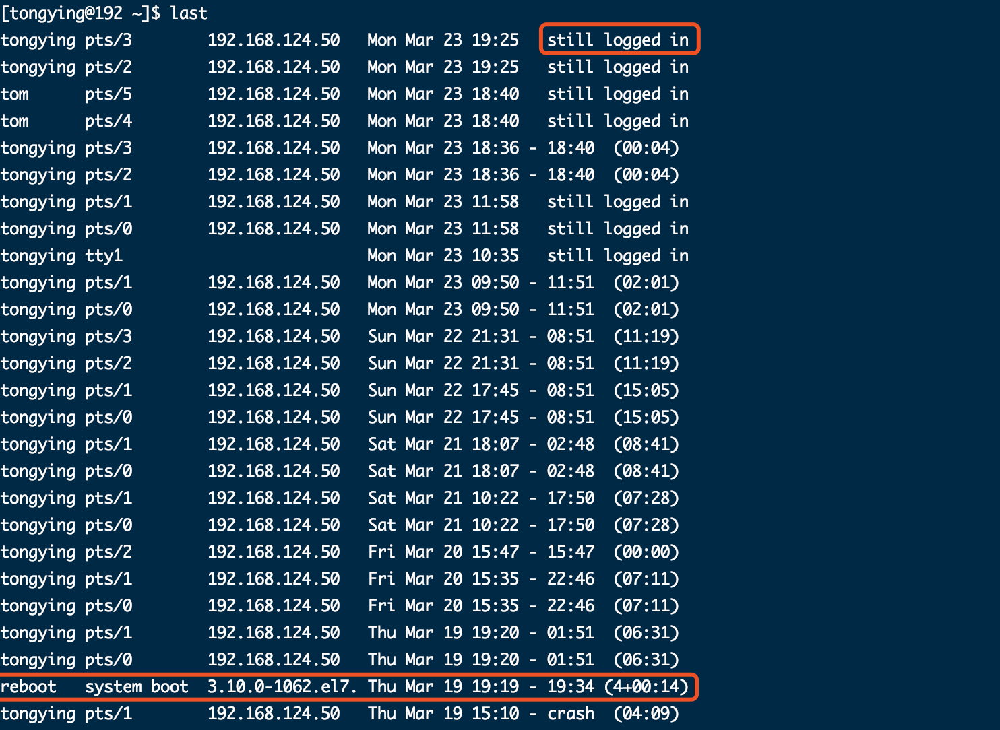

#### 10.7 `lastlog`

```
命令名称：lastlog
命令所在路径：/usr/bin/lastlog
执行权限：所有用户
语法：lastlog
		-u [用户名或uid] 查看指定用户
功能描述：检查特定用户上次登录的时间
```

例如：

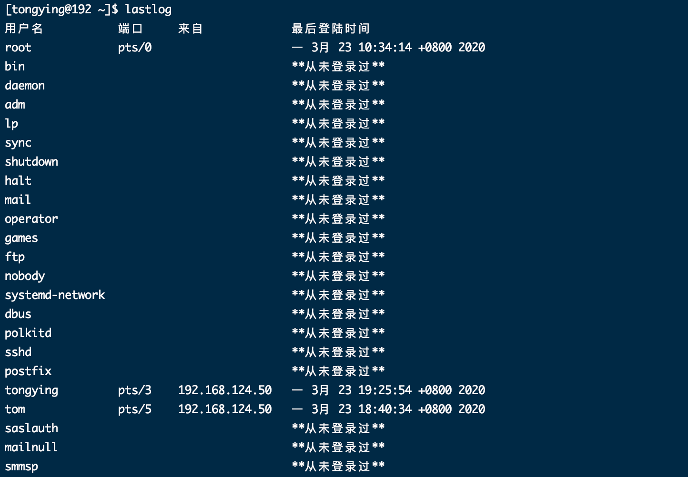


#### 10.8 `traceroute`

```
命令名称：raceroute
命令所在路径：/bin/traceroute
执行权限：所有用户
语法：traceroute
功能描述：显示数据包到主机间的路径
```

例如：

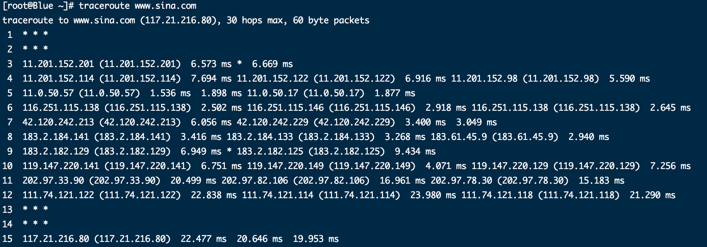


#### 10.9 `netstat`

```
命令名称：netstat
命令所在路径：/bin/netstat
执行权限：所有用户
语法：netstat [选项]
功能描述：显示网络相关信息
		-t TCP协议
		-u UDP协议
		-l 监听
		-r 路由
		-n 显示ip地址和端口号
```

例如：

```shell
# 查看本机监听的端口
netstat -tlun
# 查看本机所有的网络连接
netstat -an
# 查看本机路由表
netstat -rn
```

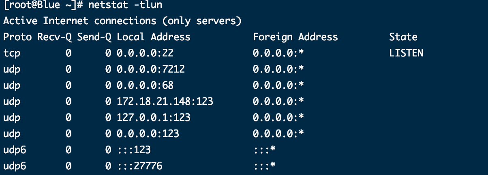

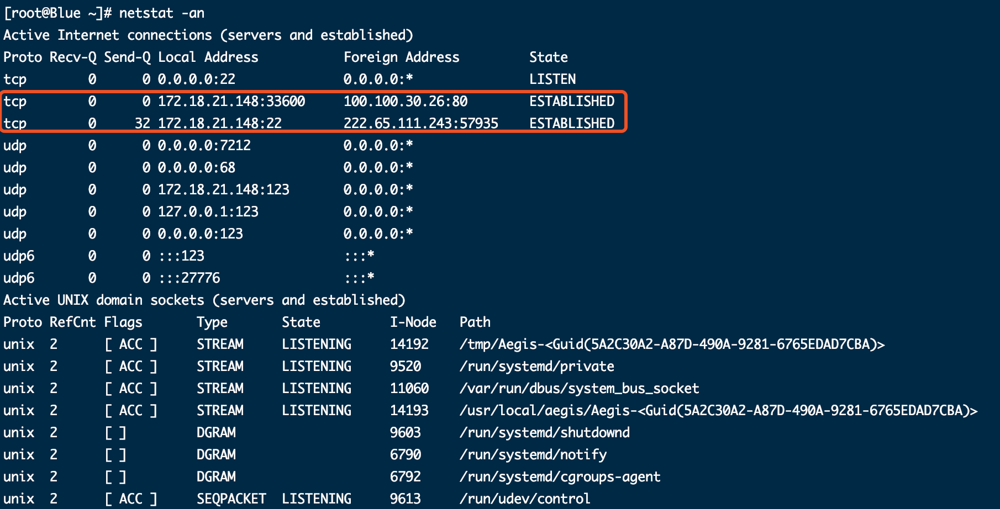

`netstat -an`比`netstat -tlun`可以多了解到已经建立的连接。

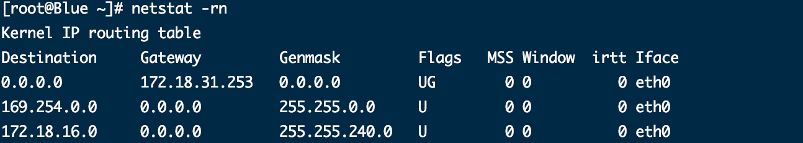


#### 10.10 `setup`

```
命令名称：setup
命令所在路径：/usr/bin/setup
执行权限：root
语法：setup
功能描述：配置网络
```

例如：

```shell
setup
```

- RedHat专有命令
- 配置永久生效
- CentOS7使用`nmtui`进行配置

#### 10.11`mount`

```
命令名称：mount
命令所在路径：/bin/mount
执行权限：所有用户
语法：mount [-t 文件系统] 设备文件名 挂载点
功能描述：
```

- /media目录就是用来做挂载点的

例如：

```shell
# 创建挂载目录
mkdir /mnt/cdrom
# 挂载光盘
mount -t iso9660 /dev/sr0/ /mnt/cdrom
```

所谓挂载，即是找到硬件，分配设备文件名，再找到一个盘符，然后把设备文件名和盘符连接起来。

- 卸载盘符

```
# 不能在挂载点下面进行卸载
umount 设备文件名
```

### 11 关机重启命令

#### 11.1 `shutdown`

```
shutdown [选项] 时间
		-c 取消前一个关机命令
		-h 关机
		-r 重启
```

例如：

```shell
# 现在关机
shutdown -h now
# 8点半关机
shutdown -h 20:30
```

#### 11.2 其他关机命令

```
halt
poweroff
init 0
```

#### 11.3 其他重启命令

```
reboot
init 6
```

#### 11.4 系统运行级别

```
0	关机
1	单用户
2	不完全多用户，不含NFS服务
3	完全多用户
4	未分配
5	图形界面
6	重启
```

- CentOS7用`targets`代替运行级别，默认情况下有两个主要的`target`

```
multi-user.target	类似于runlevel3
graphical.target	类似于runlevel5
```

- 查询当前默认`target`

```shell
# 查询默认target
systemctl get-default
# 查询系统运行级别
runlevel
```

- 设置默认`target`

```
 systemctl set-default TARGET.target
```

例如：


#### 11.5 退出登录命令

```
logout
```

**强调：服务器上进行操作后一点要logout**

## 二、文本编辑器Vim

1. 插入命令

```
a	在光标所在字符后插入
A	在光标所在行行尾插入
i	在光标所在字符前插入
I	在光标所在行行首插入
o	在光标下插入新行
O	在光标上插入新行
```

2. 定位命令

```
:set nu		设置行号
:set nonu	取消行号
gg			到第一行
G			到最后一行
ng			到第n行
:n			到第n行
$			移至行尾
0			移至行前
```

3. 删除命令

```
x			删除光标所在处字符
nx			删除光标所在处后n个字符
dd			删除光标所在行，ndd删除n行
dG			删除光标所在行到文件末尾内容
D			删除光标所在处到行尾内容
:n1,n2d		删除指定范围的行
```

4. 复制和剪切

```
yy			复制当前行
nyy			复制当前行以下n行
dd			剪切当前行
ndd			剪切当前行以下n行
p|P			粘贴在当前光标所在行下｜上
```

5. 替换和取消命令

```
r			取代光标所在处字符
R			从光标所在处开始替换字符，按ESC结束
u			取消上一步操作
```

6. 搜索和搜索替换

```
/string				搜索指定字符串，搜索时忽略大小写:set ic
n					所有指定字符串的下一个出现位置
:%s/old/new/g		全文替换指定字符串
:n1,n2s/old/new/g	在一定范围内替换指定字符串
```

7. 保存和退出命令

```
:w					保存修改
:w new_filename		另存为指定文件
:wq					保存修改并退出
ZZ					快捷键，保存修改并退出
:q!					不保存修改退出
:wq!				保存修改并退出（文件所有者及root可使用）
```

8. vim使用技巧

```
导入命令执行结果	   :r !命令
定义快捷键			 :map 快捷键 触发命令
连续行注释			 :n1,n2s/^/#/g
					:n1,n2s/^#//g
					:n1,n2s/^/\/\//g
替换：				  ab mymail tom@163.com
```

例如：自定义快捷键

```
# 注释光标所在行
:map ^p I#<ESC>				# ^p(CTRL+v+p)
:map ^B 0x					# ^B(CTRL+v+B)
```

- **永久保存编辑模式命令**

  在用户家目录下的`.vimrc`文件内写入并进行保存

## 三、软件包管理

### 1. 简介

1. 软件包分类

- 源码包
- 二进制包（RPM包，系统默认包）

2. 源码包

源码包的优点：

```
(1)开源，如果有足够的能力，可以修改源代码
(2)可以自由选择所需功能
(3)软件是编译安装，所以更加适合自己的系统，更加稳定高效
(4)卸载方便
```

源码包的缺点：

```
(1)安装过程步骤较多，尤其安装较大的软件集合时（如LAMP环境搭建），容易出现拼写错误
(2)编译过程时间较长，安装比二进制安装时间长
(3)因为是编译安装，安装过程中一旦报错，新手很难解决
```

3. RPM包

二进制包的优点：

```
(1)包管理系统简单，只通过几个命令就可以实现包的安装、升级、查询和卸载
(2)安装速度比源码包安装快得多
```

二进制包缺点：

```
(1)经过编译，不再可以看到源代码
(2)功能选择不如源代码灵活
(3)依赖性
```

### 2. RMP命令管理

#### 2.1 包命名与依赖性

1. RPM包命名规则

```
httpd-2.2.15-15.el6.centos.1.i686.rpm
​httpd		软件包名
​2.2.15		软件版本
​15			软件发布的次数
​el6.centos	适合的linux平台
​i686		适合的硬件平台
​rpm		rpm包扩展名
```

2. RPM包依赖性

```
树形依赖：a→b→c
环形依赖：a→b→c→a
模块依赖：模块依赖查询网站www.rpmfind.net
```

#### 2.2 安装升级与卸载

1. 包全名与包名

```
包全名：操作的包是没有安装的软件包时，使用包全名，而且要注意路径
包名：操作已经安装的软件包时，使用包名。是搜索/var/lib/rpm/中的数据库
```

2. RPM安装

```
rpm -ivh 包全名
	-i (install)	安装
	-v (verbose)	显示详细信息
	-h (hash)		显示进度
	--nodeps		不检测依赖性
```

3. RPM包升级

```
rpm -Uvh 包全名
	-U (upgrade)	升级
```

4. 卸载

```
rpm -e 包名
	-e (erase)		卸载
	--nodeps		不检查依赖性
```

#### 2.3 查询

1. 查询是否安装

```
# 查询是否安装
rpm -q 包名
	-q (query)		查询
# 查询所有已安装的rpm包
rpm -qa
	-a (all)		所有的
```

2. 查询软件包详细信息

```
rpm -qi 包名
	-i (information)	查询软件安装信息
	-p (package)		查询未安装包信息
```

3. 查询包中文件安装位置

```
rpm -ql 包名
	-l (list)		列表
	-p (package)	查询未安装包信息
```

4. 查询系统文件属于哪个RPM包

```
rpm -qf 系统文件名
	-f (file) 查询系统文件属于哪个软件包
```

5. 查询软件包的依赖性

```
rpm -qR 包名
	-R (requires)	查询软件包的依赖性
	-p (package)	查询未安装包信息
```

#### 2.4 校验和文件提取

1. RPM包校验

```
rpm -V 已安装的包名
	-V (verify)		校验指定RPM包中的文件
```

校验RPM包安装后文件是否被修改。

验证内容中的8个信息的具体内容如下：

```
S	文件大小是是否改变
M	文件的类型或文件的权限是否被改变
5	文件MD5校验和是否改变（可以看成文件内容是否改变）
D	表示文件的major和minor号是否一致
L	文件的路径是否改变
U	文件的属主（所有者）是否改变
G	文件的属组是否改变
T	文件的修改时间是否改变
```

文件类型：

```
c	配置文件	（config file）
d	普通文件	（documentation）
g	鬼文件		 （ghost file），很少见，该文件不该被这个RPM包包含
l	授权文件	（licence file）
r	描述文件	（read me）
```

2. RPM包中文件提取

```
rpm2cpio 包全名 | cpio -idv .文件绝对路径
	rpm2cpio	将rpm包转化为cpio格式的命令
	cpio		是一个标准工具，它用于创建软件档案文件和从档案文件中提					取文件
# cpio命令的标准格式
cpio 选项 <[文件｜设备]
	-i	copy-in模式，还原
	-d	还原时自动新建目录
	-v	显示还原过程
```

例如：

误删除了某个系统文件，只需要查询该文件所属的RPM包，再提取出来放到适当的位置即可。以`ls`为例。

```shell
# 查询ls命令所属软件包
rpm -qf /bin/ls
# 假装删除ls命令
mv /bin/ls /tmp/
# 查看ls命令在RPM包中的绝对路径
rpm -qlp coreutils-8.22-24.el7.x86_64.rpm | grep ls
# 提取RPM包中ls命令,注意.后面跟的路径必须和上面查询的一致
rpm2cpio coreutils-8.22-24.el7.x86_64.rpm | cpio -idv ./usr/bin/ls
# 把ls命令复制回/bin/目录，修复文件的丢失
cp /root/usr/bin/ls /bin
```

### 3. yum在线管理

#### 3.1 IP地址配置和网络yum源

1. IP地址配置

CentOS已经`setup`命令已经没有网络配置的功能了，使用`nmtui`进行配置

想要访问公网必须配置IP、子网掩码、网关和DNS。

2. 配置网络yum源

```
vim /etc/yum.repos.d/CentOS-Base.repo
[base]		容器名称，一定要放在[]中
name		容器说明，可以自己随便写
mirrorlist	镜像站点，这个可以注释掉
baseurl		yum源服务器的地址，默认是CentOS官方的yum源服务器，可修改为				国内的
enabled		此容器是否生效，如果不写或写成enabled=1都是生效，写成				enabled=0就是不生效
gpgcheck	如果是1是指RPM的数字证书生效，如果是0则不生效
gpgkey		数字证书的公钥文件保存位置，不用修改
```

例如：

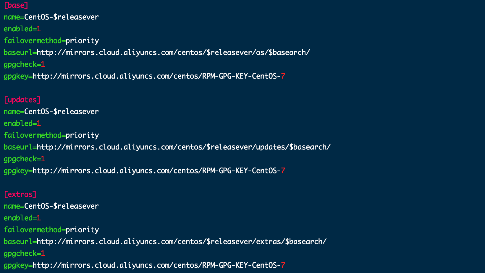


#### 3.2 yum命令

1. 常用yum命令

- 查询

查询所有可用软件包列表：

```
yum list
```

搜索服务器上所有和关键字相关的包：

```
yum search 关键字
```

- 安装

```
yum -y install 包名
	install 安装
	-y		自动回答yes
```

- 升级

```
yum -y update 包名
	update	升级
	-y		自动回答yes
```

**注意：**`yum -y update`不接包名时是指升级所有软件包，包括系统内核，需要做一定的配置才能启动，远程连接可能再也不能开机了，慎用。

- 卸载

```
yum -y remove 包名
	remove	卸载
	-y		自动回答yes
```

**注意：**当卸载软件时，该软件依赖的软件包也会被卸载，如果这个软件包不止被当前卸载的软件依赖，可能会影响其他软件运行。故服务器上应最小化安装，尽量不卸载，尽量不使用yum卸载。

2. yum软件组管理命令

列出所有可用的软件组列表：

```
yum grouplis
```

安装指定软件组，组名可以由`grouplist`查询出来

```
yum groupinstall 软件组名
```

卸载指定软件组：

```
yum groupremove 软件组名
```

#### 3.2 光盘yum源搭建

1）挂载光盘

```
mount /dev/sr0 /mnt/cdrom
```

2）让网络yum源文件失效

```
cd /etc/yum.repos.d/
mv CentOS-Base.repo CentOS-Base.repo.bak
mv CentOS-Debuginfo.repo CentOS-Debuginfo.repo.bak
mv CentOS-Vault.repo CentOS-Vault.repo.bak
```

3）修改光盘yum源文件

```
vim CentOS-Media.repo
[c6-media]
name=CentOS-$Releaserver - Media
# 地址为自己的光盘挂载地址
baseurl=file:///mnt/cdrom
# 注释掉这两个不存在的地址
# file:///media/cdrom/
# file:///media/cdrecorder/
gpgcheck=1
# 把enabled=0改为enabled=1，让这个yum源配置文件生效
gpgkey=file:///etc/pki/rpm-gpg/RPM-GPG-KEY-CentOS-6
```

### 4. 源码包管理

#### 4.1 源码包和RPM包的区别

1. 区别

```
安装之前的区别：概念上的区别
安装之后的却别：安装位置不同
```

2. RPM包安装位置

- RPM包默认安装路径

```
/etc/			配置文件安装目录
/usr/bin/		可执行的命令安装目录
/usr/lib/		程序所使用的函数库保存位置
/usr/share/doc/	基本的软件使用手册保存位置
/usr/share/man/	帮助文件保存位置
```

3. 源码包安装位置

- 安装在指定位置中，一般是

```
/usr/local/软件名/
```

4. 安装位置不同带来的影响

RPM包安装的服务可以使用系统服务管理命令（service）来管理，例如RPM包安装的apache的启动方法：

```
/etc/rc.d/init.d/httpd start
service httpd start
```

而源码包安装的服务则不能被服务管理命令管理，因为没有安装到默认路径中，所以只能用绝对路径进行服务的管理，如：

```
/usr/local/apache2/bin/apachetctl start
```

#### 4.2 源码包安装过程

1. 安装准备

- 安装C语言编译器

- 下载源码包：https://mirrors.tuna.tsinghua.edu.cn/apache//httpd/httpd-2.4.41.tar.bz2

2. 安装注意事项

- 源代码保存位置：`/usr/local/src/`

- 软件安装位置：`/usr/local/`

- 如何确定安装过程报错

  （1）安装过程停止

  （2）并出现error、warning或no的提示

3. 源码包安装过程

- 下载源码包

- 解压下载的源码包

- 进入解压缩目录

- ./configure 软件配置与检查

  （1）需要定义的功能选项

  （2）检测系统环境是否符合安装要求

  （3）把定义好的功能选项和检测系统环境信息都写入Makefile文件，便于后续编译。

  ```shell
  # 指定安装路径
  ./configure --prefix=/usr/local/apache2
  ```

- `make`

- `make install`

4. 源码安装包卸载

```
rm -rf /usr/loca/apache2/
```

### 5. 脚本安装包

1. 脚本安装包

（1）脚本安装包并不是独立的软件包类型，常见安装的是源码包

（2）是认为把安装过程写成了自动安装的脚本，只要执行脚本，定义简单的参数，就可以完成安装。

（3）非常类似于windows下软件的安装过程。

2. Webmin的作用

Webmin是一个基于Web的Linux系统管理界面，可以通过图形化的方式设置用户账户、Apache、DNS、文件共享等服务。

3. Webmin安装过程

（1）下载软件

（2）解压缩并进入解压目录

（3）执行安装脚本

```
./setup.sh
```

## 四、用户和用户组管理

### 1. 用户配置文件

#### 1.1 用户信息文件

1. 用户管理介绍

越是对安全性要求高的服务器，越需要建立合理的用户权限等级制度和服务器操作规范

在Linux中主要是通过用户配置文件来查看和修改用户信息。

2. `/etc/passwd`

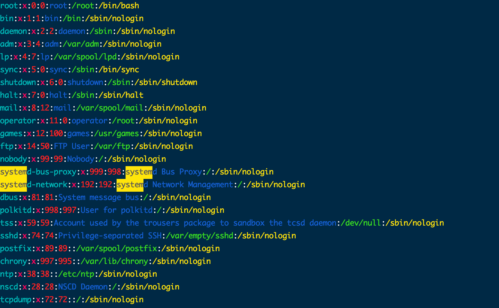

使用`man 5 passwd`命令可以查看passwd文档帮助信息。其格式如下

```
account:password:UID:GID:GECOS:directory:shell
[1]用户名称
[2]密码标识
[3]UID（用户ID）
	0			：超级用户
	1-499		：系统用户（伪用户）
	500-65535	：普通用户
[4]GID（用户初始组）
[5]用户说明
[6]家目录
	普通用户	：/home/用户名/
	超级用户	：/root/
[7]登录之后的shell
```

3. 初始组和附加组

初始组：就是指用户一登录就立刻拥有这个用户组的相关权限，每个用户的初始组只能有一个，一般就是用和这个用户的用户名相同的组名作为这个用户的初始组。建议别瞎改。

附加组：指用户可以加入多个其他的用户组，并拥有这些组的权限，附加组可以有多个。

4. shell是什么

shell就是Linux的命令解释器。

在/etc/passwd中，除了标准shell是/bin/bash外，还可以写如/sbin/nologin

#### 1.2 影子文件

`etc/shadow`

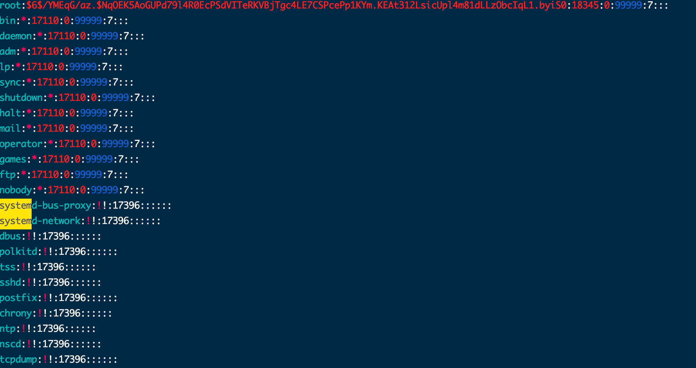

格式说明：

```
[1]用户名
[2]加密密码
	·加密算法升级为SHA512散列加密算法
	·如果密码位是"!!"或"*"代表没有密码，不能登录
[3]密码最后一次修改时间
	·使用1970年1月1日作为标准时间，每过一天时间戳+1
[4]两次密码的修改间隔时间（和第3个字段相比）
[5]密码有效期（和第3个字段相比）
[6]密码修改到期前的警告天数（和第5个字段相比）
[7]密码过期后的宽限天数（和第5个字段相比）
	·0	:代表密码过期后立即失效
	·-1	:代表永远不会失效
[8]账号失效时间
	·要用时间戳表示
[9]保留
		
```

- 时间戳换算

```shell
# 把时间戳换算为时间
$ date -d "1970-01-01 18345 days"
2020年 03月 24日 星期二 00:00:00 CST

# 把日期换算成时间戳
$ echo $(($(date --date="2020/03/24" +%s)/86400+1))
18345
```

#### 1.3 组信息文件

1. 组信息文件`/etc/group`


格式说明：

```
[1]组名
[2]组密码标识
[3]GID
[4]组中附加用户（看不到初始用户）
```

2. 组密码文件`/etc/gshadow`

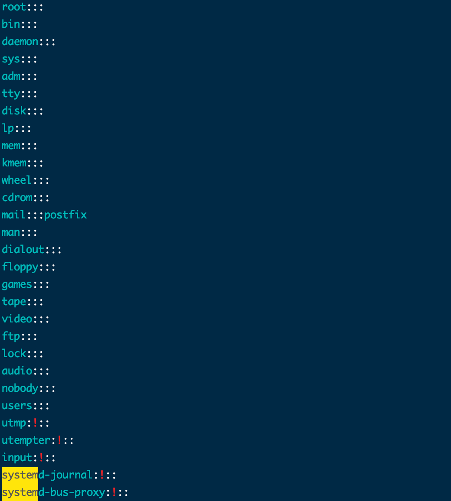

格式说明：

```
[1]组名
[2]组密码
[3]组管理员用户名
[4]组中附加用户
```

### 2. 用户管理相关文件

1. 用户的家目录

普通用户：`/home/用户名/`，所有者和所属组都是此用户，权限是700

超级用户：`/root/`，所有者和所属组都是root，权限是550

【问题】把一个用户变为超级用户，其家目录也会改变吗？

```
修改/etc/passwd文件将该用户的UID改为0即变为了超级用户，但是其家目录是不会变的。
```

2. 用户的邮箱

`/var/spool/mail/用户名`

3. 用户模版目录

`/etc/skel`


作用：新建用户的家目录下的文件和目录就来自于用户模版目录。

### 3. 用户管理命令

#### 3.1 `useradd`

1. `useradd`命令格式

```
useradd [选项] 用户名
	-u UID	:手工指定用户的UID号
	-d 家目录:手工指定用户的家目录
	-c 用户说明:手工指定用户的说明
	-g 组名:手工指定用户的初始组
	-G 组名:手工指定用户的附加组
	-s shell:手工指定用户的登录shell。默认是/bin/bash
```

2. 添加默认用户

```
user add tom
```

查看相关文件和目录：

```shell
grep tom /etc/passwd
grep tom /etc/shadow
grep tom /etc/group
grep tom /etc/gshadow
ll -d /home/tom/
ll /var/spool/mail/tom
```


3. 指定选项添加用户

```
useradd -u 550 -G root,bin -d /home/tom/ -c "test user" -s \ /bin/bash tom
```

4. 用户默认值文件

```
/etc/default/useradd
	· GROUP=100				:用户默认组
	· HOME=/home			:用户家目录
	· INACTIVE=-1			:密码过期宽限天数（shadow文件7字段）
	· EXPIRE=				:密码失效时间（8）
	· SHELL=/bin/bash		:默认shell
	· SKEL=/etc/skel		:模版目录
	· CREATE_MAIL_SPOOL=yes	:是否建立邮箱
```

```
/etc/login.defs
PASS_MAX_DAYS 99999		:密码有效期（5）
PASS_MIN_DAYS 0			:密码修改间隔（4）
PASS_MIN_LEN 5			:密码最小位数（PAM）
PASS_WARN_AGE 7			:密码到期警告（6）
UID_MIN 1000				:最小和最大UID范围
GID_MAX 60000			
ENCRYPT_METHOD SHA512	:加密模式
```

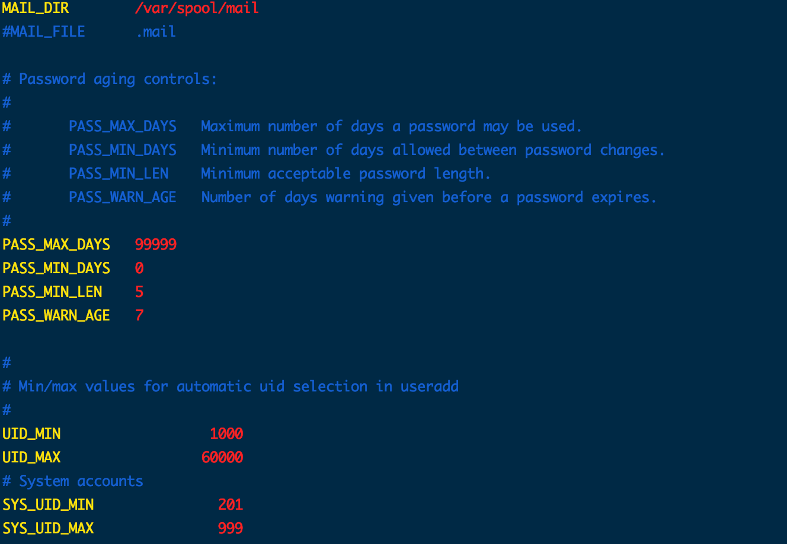


#### 3.2 `passwd`

1. passwd命令格式

```
passwd [选项] 用户名
	 -S		查询用户密码的密码状态，近root用户可用
	 -l		暂时锁定用户，仅root用户可用
	 -u		解锁用户，仅root用户可用
	 --stdin	可以通过管道符输出的数据作为用户的密码
```

2. 查看密码状态

```shell
passwd -S tom
```

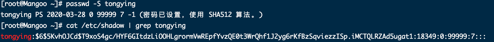

3. 锁定用户和解锁用户

```shell
passwd -l tom		# 锁定
passwd -u tom		# 解锁
```

查看`/etc/shadow`：


其实锁定用户就是将用户密码前加!，让其失效。

4. 使用字符串作为用户的密码

```
echo "123" | passwd --stdin tom
```

应用场景：shell编程，批量添加用户。

#### 3.3 `usermod`和`chage`

1. 修改用户信息`usermod`

```
usermod [选项] 用户名
 	-u UID		：修改用户的UID
 	-c 用户说明   ：修改用户的说明信息
	 -G 组名	   ：修改用户的附加组
	 -L			：临时锁定用户（lock）
	 -U			：解锁用户锁定（unlock）
```

2. 修改用户密码状态`chage`

```
chage [选项] 用户名
	-l:		 列出用户的详细密码状态
	-d 日期:	修改密码最后一次修改时间（shadow三字段）
	-m 天数:	两次密码修改间隔（4字段）
	-M 天数:	密码有效期（5字段）
	-W 天数:	密码过期警告天数（6字段）
	-l 天数:	密码过期后宽限天数（7字段）
	-E 日期:	账号失效时间（8字段）
```

#### 3.4 `userdel`和`su`

1. 删除用户命令`userdel`

```
userdel [-r] 用户名
	-r:		删除用户的同时删除用户家目录(一般都要加)
```

- 手工删除用户

```
vim /etc/passwd
vim /etc/shadow
vim /etc/group
vim /etc/gshadow
rm -rf /var/spool/mail/用户名
rm -rf /home/用户名/
```

2. 查看用户ID

```
id 用户名
```


3. 切换用户身份

```
su [选项] 用户名
	- : 	 选项只使用"-"代表连带用户的环境变量一起切换
	-c 命令:	仅执行一次命令，而不切换用户身份
```

**注意：**切换用户时如果省略“-”，则用户的环境变量并未被切换，会导致系统出错，所以一定不能省！！

### 4. 用户组管理命令

1. 添加用户组`groupadd`

```
groupadd [选项] 组名
	-g GID:		指定组ID 
```

2. 修改用户组`groupmod`

``` 
groupmod [选项] 组名
	-g GID:		  修改组ID
	-n 新组名:		修改组名
```

例如：

```
# 将group1组名修改为testgrp1
groupmod -n testgrp1 group1
```

3. 删除用户组`groupdel`

```
groupdel 组名
```

- 初始组和初始用户相互依存，所以有初始用户的用户组是不能删除的。

4. 把用户添加入组或从组中删除`gpasswd`

```
gpasswd 选项 组名
	-a 用户名:	把用户加入组
	-d 用户名:	把用户从组中删除
```

- 直接修改/etc/group文件的第4个选项可以吗？

  ```
  Of course
  ```

这里操作的是附加组用户。

## 五、权限管理

### 1. ACL权限

#### 1.1 简介与开启

1. ACL权限简介

**场景假设**：目录/project的权限为770，即`rwxrwx—`，此时来了一个新用户，他对Linux不熟练，当他对该目录进行操作时，只能给他分配`r-x`的权限，应该怎么办呢？

```
将该用户加到ugo任何一个组都不合适，所以ACL的出现就是为了解决ugo三个角色不够用的问题。
```

2. 查看分区ACL权限是否开启

```
# dumpe2fs是查询指定分区详细文件系统信息的命令
dumpe2fs -h /dev/vda1
	-h:		仅显示超级块中信息，而不显示磁盘块组的详细信息
```

例如：

先查看当前Linux机器都有哪些分区：

```shell
df -h
```


查看指定分区ACL权限是否开启

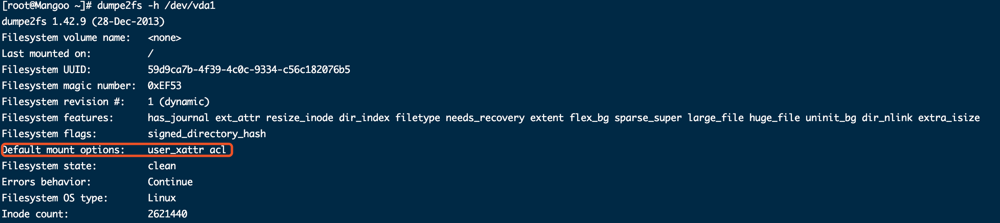

现在的Linux默认分区基本都已经开启了acl权限。

3. 临时开启分区ACL权限

```
# 重新挂载根分区，并挂载加入ACL权限
mount -o remount,acl /
```

4. 永久开启分区ACL权限

```
vim /etc/fstab
```

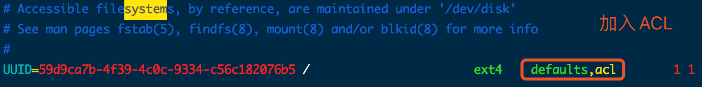

```
# 重新挂载文件系统或重启系统，使修改生效
mount -o remount /
```

#### 1.2 查看与设定

1. 查看ACL权限

```
getfacl 文件名
```

2. 设定ACL权限的命令

```
setfacl 选项 文件或目录
	-m:		设定ACL权限
	-x:		删除指定的ACL权限
	-b:		删除所有的ACL权限
	-d:		设定默认ACL权限
	-k:		删除默认ACL权限
	-R:		递归设定ACL权限
```

3. 给用户设定ACL权限

```
setfacl -m u:用户名:权限 文件或目录
```

例如：

```shell
useradd tom
useradd boby
useradd coco
groupadd testgrp1
mkdir /home/project
chown root:testgrp1 /home/project/
chmod 770 /home/project/
setfacl -m u:tom:rx /home/project/
```

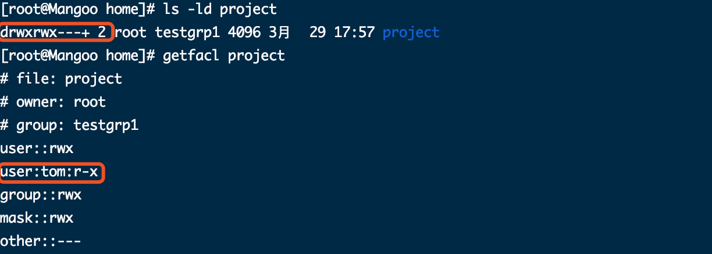

4. 给用户组设定ACL权限

```
setfacl -m g:组名:权限 文件或目录
```

例如:

```
groupadd testgrp2
setfacl -m g:testgrp2:rwx /home/project/
```

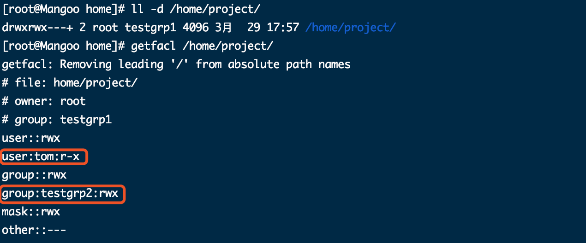

#### 1.3 最大有效权限与删除

1. 最大有效权限mask

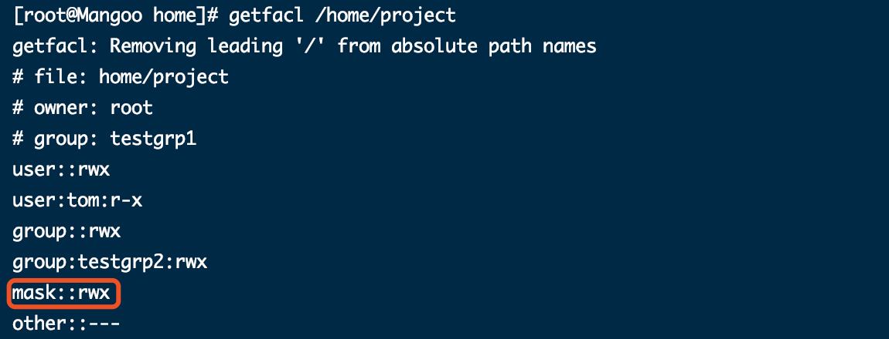

mask是用来指定最大有效权限的，如果给用户赋予了ACL权限，是要与mask的权限**“相与”**才能得到用户的真正权限。

修改最大有效权限：

```
setfacl -m m:rx 文件或目录
```

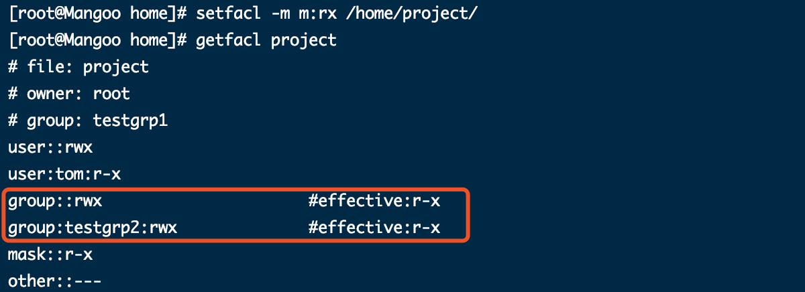

**影响范围：所属组和ACL权限。**

2. 删除ACl权限

```
# 删除所有的ACl权限
setfacl -b 文件或目录
# 删除特定用户或特定组的ACL权限
setfacl -x u:user 文件或目录
setfacl -x g:group 文件或目录
```

#### 1.4 默认与递归ACL权限管理

1. 递归ACL权限

递归是父目录在设定ACL权限时，所有的子文件和子目录也会拥有所有的ACL权限。

```
setfacl -m u:user:mode -R 目录或目录
```

- -R选项不能放全面，只能放后面
- 只针对已经存在的子目录和字文件

2. 默认ACL权限

默认ACL权限的作用是如果给父目录设定了默认ACL权限，那么父目录中所有新建的子文件的都会继承父目录的ACL权限。

```
# 设定默认ACL权限
setfacl -m d:u:user:mode 文件或目录
# 删除默认ACL权限
setfacl -k 文件或目录
```

- 只针对新建的子文件或目录

### 2. 文件特殊权限

#### 2.1 `SetUID`

1. `SetUID`的功能

```
（1）只有可以执行的二进制文件才能设定`SUID`权限。
（2）命令执行者要对该程序具有x（可执行）权限。
（3）命令执行者在执行该程序时或得该文件属主的身份（在执行的过程中灵魂附体为文件的属主）。
（4）SetUID权限只在该程序执行过程中有效，也就是说身份改变只在该程序执行过程中有效。
```

passwd命令拥有SetUID权限，所以普通用户可以修改自己的密码


cat命令没有SetUID权限，所以普通用户不能查看/etc/shadow文件内容


2. 设定`SetUID`的方法

```
# 4代表SUID权限
chmod 4755 文件名
chmod u+s 文件名
```

例如：


注意：设定SUID权限的条件`二进制文件 && 普通用户具有可执行权限`，如果用户没有可执行权限而为其设定SUID的权限，系统将会报错，提示为将SUID的权限标识由s变为S。


3. 取消SUID的方法

```
chmod 755 文件名
chmod u-s 文件名
```

4. 危险的SetUID

```
(1)关键目录应严格控制写权限，比如"/","/usr"等。
(2)用户的密码设置要严格遵守密码三原则。
(3)对系统中默认应该具有SetUID权限的文件做一列表，定时检查有没有这之外的文件被设置了SetUID权限。
```

例如：

给普通用户加上`SetUID`权限，普通用户就可以直接用vim修改`/etc/passwd`文件，该用户将其`uid`改成了`0`，Yohoo，直接上天。

#### 2.2 `SetGID`

1. `SetGID`针对文件的作用

```
(1)只有可执行的二进制程序才能设置SGID权限
(2)命令执行者要对该程序拥有x（执行）权限
(3)命令执行者在执行命令的时候，组身份升级为该程序文件的属组
(4)SetGID权限同样只在该程序执行过程中有效，也就是说组身份改变只在程序执行过程中有效
```

例如：

普通用户对mlocate.db并没有可读的权限，但是为什么可以使用`locate`命令呢？


```
(1)/usr/bin/locate是可执行二进制程序，可以赋予SGID
(2)执行用户tom对/usr/bin/locate命令拥有可执行权限
(3)执行/usr/bin/locate命令时，组身份会升级为slocate组，而slocate组对/var/lib/mlocate/mlocate.db数据库拥有r权限，所以普通用户可以使用locate命令查询mlocate.db数据库
(4)命令结束，tom用户的组身份返回为tom组
```

2. `SetGID`针对目录的作用

```
(1)普通用户必须对此目录拥有r和x权限，才能进入此目录
(2)普通用户在此目录中的有效组会变成此目录的所属组
(3)若普通用户对此目录拥有w权限时，新建文件的默认所属组是这个目录的所属组
```

例如：

```shell
mkdir /tmp/sgidtest
chmod 2777 /tmp/sgidtest
su - tom
touch /tmp/sgidtest/smile
ls -l /tmp/sgidtest/smile
```


3. 设定`SetGID`

```
# 2代表SGID权限
chmod 2755 文件名
chmod g+s 文件名
```

4. 取消`SetGID`

```
chmod 755 文件名
chmod g-s 文件名
```

#### 2.3 `Stickey BIT`

1. SBIT粘着位作用

```
(1)粘着位目前只对目录生效
(2)普通用户对该目录拥有w和x权限，即普通用户可以在此目录中拥有写入权限
(3)如果没有粘着位，因为普通用户拥有w权限，所以可以删除此目录下所有文件，包括其他用户建立的文件。一旦赋予了粘着位，除了root可以删除所有权限，普通用户就算拥有w权限，也只能删除自己建立的文件，但不能删除其他用户建立的文件
```

2. 设置与取消粘着位

设置粘着位：

```
chmod 1755 目录名
chmod o+t 目录名
```

取消粘着位：

```
chmod 755 目录名
chmod o-t 目录名
```

例如：


### 3. 文件系统属性`chattr`权限

1. `chattr`命令格式

```
chattr [+-=] [选项] 文件或文件名
	+:	增加权限
	-:	删除权限
	=:	等于某权限
```

选项：

```
	i: 如果对文件设置i属性，那么不允许对文件进行删除、改名，也不能添加和修改数据；如果对目录设置i属性，那么只能修改目录下文件的内容，但不允许建立和删除文件。
	a: 如果对文件设置a属性，那么只能在文件中增加数据，但是不能修改也不能删除数据；如果对目录设置a属性，那么只允许在目录中建立和修改文件，但是不允许删除。
```

2. 查看文件系统属性

```
lsattr 选项 文件名
	-a	显示所有目录和文件
	-d	如果目标是目录，仅列出目录本身的属性，而不是子文件的
```

例如：


用途：chattr是为了防止包括root在内的用户对文件或目录进行误操作。

### 4. `sudo`权限

1. `sudo`权限

root把本来超级用户执行的命令赋予普通用户执行

`sudo`操作对象是系统命令

2. `sudo`使用

需先将用户及运行用户执行的命令添加到`/etc/sudoers`

```
# 实际修改的是/etc/sudoers文件
visudo

# 用户名	被管理主机的地址=(可以使用的身份)	授权命令(绝对路径)
root	ALL=(ALL)	ALL

# 组名	被管理主机的地址=(可使用的身份)	授权命令(绝对路径)
%group	ALL=(ALL)	ALL
```

例如：

授权tom可以重启服务器

```
visudo
tom		ALL=(ALL)	/sbin/shoutdown -r now
```

可以用`sudo -l`查看赋予当前用户的`sudo`命令

## 六、文件系统管理

### 1. 分区和文件系统

1. 分区类型

主分区：总共最多只能分4个。

扩展分区：只能有一个，也算做主分区的一种，也就说主分区加扩展分区最多有四个。但是扩展分区不能存储数据和格式化，必须再划分成逻辑分区才能使用。

逻辑分区：逻辑分区是扩展分区中划分的，如果是IDE硬盘，Linux最多支持59个逻辑分区，如果是SCSI硬盘Linux最多支持11个逻辑分区。

2. 分区表示方法




以上主分区的设备文件名是固定的，即主分区是`/dev/sda1`~`/dev/sda2`，就算主分区只有一个，那其分区文件名为`/dev/sda1`，扩展分区为`/dev/sda2`，逻辑分区也要从`/dev/sda5`开始编号。

3. 文件系统

- ext2

ext2是文件系统的升级版本，Red Hat Linux7.2版本以前的系统默认是ext2文件系统。1993年发布，最最大支持16TB的分区和最大2TB的文件（1TB=1024GB=1024*1024MB）。

- ext3

ext3文件系统是ext2文件系统的升级版本，最大的区别就是带日志功能，以在系统突然停止时提高文件系统的可靠性。支持最大16TB的分区和最大2TB的文件。

- ext4

它是ext3文件系统的升级版。ext4在性能、伸缩性和可靠性方面进行了大量的改进。EXT4变化较大，比如向下兼容EXT3、最大1EB文件系统和16TB文件、无限数量子目录Extends连续数据块概念、多块分配、延迟分配、持久预分配、快速FSCK、日志校验、无日志模式、在线碎片整理、inode增强、默认启用barrier等。是CentOS6.3的默认文件系统。（1EB=1024PB=1024*1024TB）。

### 2. 文件系统常用命令

#### 2.1 `df`、`du`、`fsck`、`dumpe2fs`

1. 文件系统查看命令`df`

```
df [选项] [挂载点]
	-a:	显示所有的文件系统信息，包括特殊文件系统，如/proc、/sysfs
	-h:	使用习惯单位显示容量，如KB、MB、GB
	-T:	显示文件系统类型
	-m:	以MB为单位显示容量
	-k:	以KB为单位显示容量。默认是以KB为单位
```

例如：


2. 统计目录或文件大小

```
du [选项] [目录或文件名]
	-a:	显示每个子文件的磁盘占用量。默认只统计子目录的磁盘占用量
	-h:	使用习惯单位显示磁盘占用量，如KB、MB或GB等
	-s:	统计总占用量，而不列出子目录和子文件的占用量
```

通常只是用于统计目录的大小，文件的大小用`ls -l`即可统计，但是`ls -l`	统计目录时，显示的是该目录下的子目录名和子文件名占用的空间大小。

例如：


`du`命令会扫描挂载点下的目录和文件，将其大小做一个总和，比较耗费资源，所以，不要随便在服务器上做这种高负载操作。

- `df`命令和`du`命令的区别

（1）`df`命令是从文件系统角度考虑的，不光要考虑文件占用的空间，还要统计被命令或程序占用的空间（最常见的就是文件已经删除，但是程序并没有释放空间）

（2）`du`命令是面向文件的，只会计算文件或目录占用的空间

所以通常会有`du`的统计结果小于`df`，所以`df`看到的剩余空间才是真正的剩余空间。

3. 文件系统修复命令`fsck`

```
fsck [选项] 分区设备文件名
	-a:	不用显示设备信息，自动修复文件系统
	-y:	自动修复。和-a作用一致，不过有些文件系统只支持-y
```

系统开机时会自动进行检测，所以一般并不需要我们手动执行。

4. 显示磁盘状态命令`dumpe2fs`

```
dumpe2fs 分区设备文件名
```

例如：

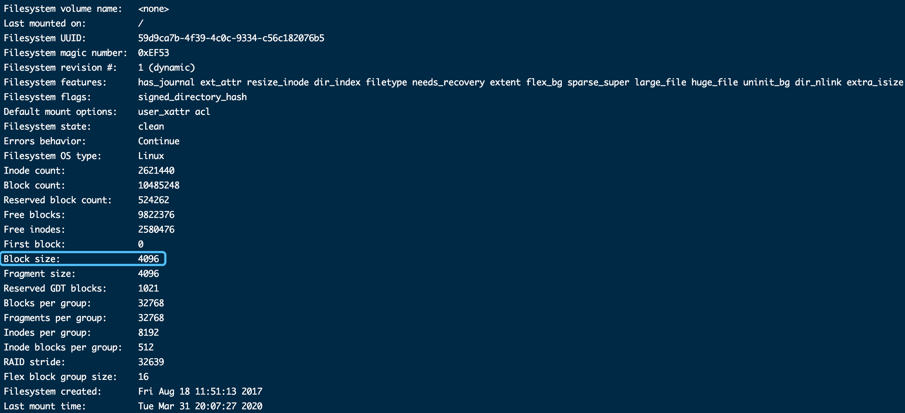

分区就是把大柜子打成一个个的小柜子，二格式化就是把小柜子打成一个个的隔断（数据块）。

#### 2.2 挂载命令

1. 查询与自动挂载

```
# 查询系统中已挂载的设备，-l会显示卷标名称
mount [-l]
# 根据配置文件/etc/fstab的内容，自动挂载
mount -a
```

挂载：把设备（如U盘）和挂载点（盘符）连接起来的过程。

2. 挂载命令格式

```
mount [-t 文件系统] [-L 卷标名] [-o 特殊选项] 设备文件名 挂载点
	-t 文件系统:	加入文件系统类型累指定挂载类型，可以有ext3、ext4、iso9660等文件系统
	-L 卷标名:		挂载指定卷标的分区，而不是按照设备文件名挂载
	-o 特殊选项:	可以指定挂载的额外选项
```

`-o 特殊选项`

| 参数            | 说明                                                         |
| --------------- | ------------------------------------------------------------ |
| `atime/noatime` | 更新访问时间/不更新访问时间，默认为更新。                    |
| `async/sync`    | 异步/同步，默认为异步。                                      |
| `auto/noauto`   | 自动/手动，`mount -a`命令执行时，是否会安装`/etc/fstab`文件内容挂载，默认为自动。 |
| `dufaults`      | 定义默认值，相当于`rw，suid，dev，exec，auto，nouser， async`这7个选项 |
| `exec/noexec`   | 执行/不执行，设定是否允许在文件系统中执行可执行文件，默认是`exec`允许。 |
| `remount`       | 重新挂载已挂载的文件系统，一般用于指定修改特殊权限。         |
| `rw/ro`         | 读写/只读，文件系统挂载时，是否具有读写权限，默认是`rw`。    |
| `suid/nosuid`   | 具有/不具有`SUID`权限，设定文件系统是否具有`SUID`和`SGID`的权限，默认是具有。 |
| `user/nouser`   | 允许/不允许普通用户挂载，设定文件系统是否允许普通用户挂载，默认是不允许，只有root可以挂载分区。 |
| `usrquota`      | 写入代表文件系统支持用户磁盘配额，默认不支持。               |
| `grpquota`      | 写入代表文件系统支持组磁盘配额，默认不支持。                 |


例如：

```
mount -9 remount,noexc /home
cd /home
vim hello.sh
chmod 755 hello.sh
./hello.sh # 这是运行不了的
mount -o remount,exec /home	# 改回来
```

#### 2.3 挂载光盘和U盘

1. 挂载光盘

```
# 建立挂载点
mkdir /mnt/cdrom
# 挂载光盘
mount -t iso9660 /dev/cdrom /mnt/cdrom
# 也可以不指定文件系统, /dev/cdrom -> /dev/sr0
mount /dev/sr0 /mnt/cdrom
```

2. 卸载命令

```
umount 设备文件名或挂载点
```

例如：

```
# 不能在挂载点目录下执行卸载命令
umount /mnt/cdrom
```

3. 挂载U盘

```
# 查看U盘设备文件名
fdisk -l
mount -t vfat /dev/sdb1 /mnt/usb/
```

**注意：Linux默认不支持NTFS文件系统。**

卸载后才能正常取出U盘。

#### 2.4 支持NTFS文件系统

1. 下载NTFS-3G插件（[地址](https://tuxera.com/opensource/ntfs-3g_ntfsprogs-2017.3.23.tgz)）

2. 安装NFTS-3G

```
# 解压
tar -zxvf ntfs-3g_ntfsprogs-2017.3.23.tgz
# 进入解也目录
cd cd ntfs-3g_ntfsprogs-2017.3.23
# 编译器准备，没有指定安装目录，安装到默认位置中
./configure
# 编译
make
# 安装
make install
```

3. 使用

```
mount -t ntfs-3G 分区设备文件名 挂载点
```

### 3. fdisk分区

#### 3.1 fdisk命令分区过程

1. 添加新硬盘
2. 查看新硬盘

```
fdisk -l
```

3. 使用fdisk命令分区

```
fdisk /dev/sdb
```

fdisk交互指令说明：

| 命令  | 说明                                                      |
| ----- | --------------------------------------------------------- |
| a     | 设置可引导标记                                            |
| b     | 编辑bsd磁盘标签                                           |
| c     | 设置DOS操作系统兼容标记                                   |
| ==d== | 删除一个分区                                              |
| ==l== | 显示已知的文件系统类型。82为Linux swap分区，83位Linux分区 |
| ==m== | 显示帮助菜单                                              |
| ==n== | 新建分区                                                  |
| o     | 建立空白DOS分区表                                         |
| ==p== | 显示分区列表                                              |
| q     | 不保存退出                                                |
| s     | 新建空白SUN磁盘标签                                       |
| t     | 改变一个分区的系统ID                                      |
| u     | 改变显示记录单位                                          |
| v     | 验证分区表                                                |
| ==w== | 保存退出                                                  |
| x     | 附加功能（仅专家）                                        |

4. 重新读取分区表信息

```
# 不用重启
partprobe
```

5. 格式化分区

```
# 只能格式化主分区和逻辑分区
mkfs -t ext4 /dev/sdb1
```

6. 建立挂载点并挂载

```
mkdir /disk1
mount /dev/sdb1 /disk1/
```

`fdisk -l`命令只能看到分区是否被正常分配，不能看到分区是否挂载，可以使用`df -h`或者`mount`。

#### 3.2 分区自动挂载与fstab文件修复

1. `/etc/fstab`文件

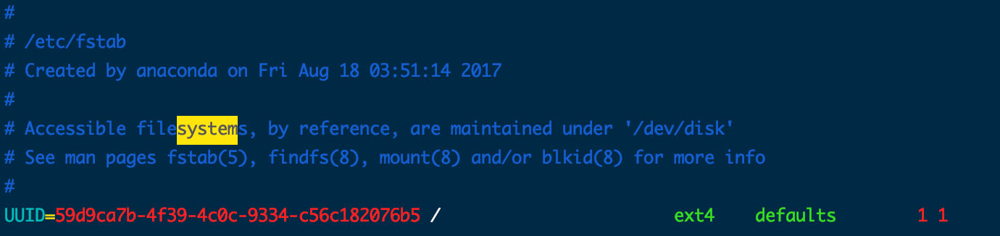

```
[1] 分区设备文件名或UUID(硬盘通用唯一识别码)
[2] 挂载点
[3] 文件系统名称
[4] 挂载参数
[5] 指定分区是否被dump备份，0代表不备份，1代表每天备份，2代表不定期备份
[6] 指定分区是否被fsck检测，0代表不检测，其他数字代表检测的优先级，1的优先级比2高
```

2. 分区自动挂载

```
vim /etc/fastab
#...
/dev/sdb1	/disk1	ext4	defaults	1 2
#...
# 根据/etc/fstab自动重新挂载，顺便检查一下有没有写错
mount -a
```

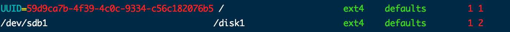

这个文件跟系统启动有关，写时千万小心，不要出错。

3. fstab文件修复

万一实在不小心写错，系统启动时会报错，可进行fstab文件修复：

```
# 重新挂载根目录
mount -o remount,rw /
# 修改fstab文件
vim /etc/fstab
```

以上修复过程仅在根分区可以正确挂载的前提下进行，若是根分区那一行写错，没救。

### 4. 分配swap分区

1. `free`命令

```
# 查看内存与swap分区使用状况
free
```


cached（缓存）：是指把读取出来的数据保存在内存当中，当再次读取时，不用读取硬盘而直接从内存当中读取，加速了数据的读取过程。

buffer（缓冲）：是指在写入数据时，先把分散的写入操作保存到内存当中，当达到一定程度再集中写入硬盘，减少了磁盘碎片和硬盘的反复寻道，加速了数据的写入过程。

2. 新建swap分区

```
fdisk /dev/sdb
```

注意：分区ID应改为82。

3. 格式化

```
mkswap /dev/sdb6
```

4. 加入swap分区

```
# 加入swap分区
swapon /dev/sdb6
# 取消swap分区
swapoff /dev/sdb6
```

5. swap分区开机自动挂载

```
vim /etc/fstab
#...
/dev/sdb6	swap	swap	defaults	0 0
#..
```

### 5. inode

1. 什么是inode

文件是存储在硬盘上的，硬盘的最小存储单位叫做扇区`sector`，每个扇区存储`512字节`。操作系统读取硬盘的时候，不会一个个扇区地读取，这样效率太低，而是一次性连续读取多个扇区，即一次性读取一个块`block`。这种由多个扇区组成的块，是文件存取的最小单位。块的大小，最常见的是`4KB`，即连续八个`sector`组成一个`block`。

一个文件必须占用一个`inode`，但至少占用一个`block`。

2. inode的内容

```
· 文件的字节数
· 文件拥有者的UID
· 文件的Group ID
· 文件的读、写、执行权限
· 文件的时间戳，共有三个：ctime指inode上一次变动的时间，mtime指文件内容上一次变动的时间，atime指文件上一次打开的时间。
· 链接数，即有多少文件名指向这个inode
· 文件数据block的位置
```

3. `stat`

````
# 插看inode信息
stat 文件名
````


4. `file`

```
# 查看文件类型
file 文件名
```


## 七、Shell

### 1. Shell概述

1. Shell是什么

Shell是一个命令行解释器，它为用户提供了一个向Linux内核发送请求以便运行程序的界面系统级程序，用户可以用Shell来启动、挂起、停止甚至编写一些程序。



Shell还是一个功能相当强大的编程语言，易编写，易调试，灵活性较强。Shell是解释执行的脚本语言，在Shell中可以直接调用Linux系统命令。

2. Shell的分类

Bourne Shell：从1979年起Unix就开始使用Bourne Shell，Bourne Shell的主文件名为sh。

C Shell：C Shell主要在BSD版的Unix系统中使用，其语法和C语言相类似而得名。

Bash：Bash与sh兼容，现在使用的Linux就是使用Bash作为用户的基本Shell。

3. Linux支持的Shell

```
/etc/shells
```


### 2. Shell脚本的执行方式

1. `echo`输出命令

```
echo [选项] [输出内容]
	-e:		支持反斜线控制的字符转换
```

| 控制字符 | 作用                                                         |
| -------- | ------------------------------------------------------------ |
| \\\      | 输出\本身                                                    |
| \a       | 输出警告音                                                   |
| \b       | 退格键，也就是向左删除键                                     |
| \c       | 取消输出行末的换行符，和“-n”选项一致                         |
| \e       | ESCAPE键                                                     |
| \f       | 换页符                                                       |
| \n       | 换行符                                                       |
| \r       | 回车键                                                       |
| \t       | 制表符，也就是Tab键                                          |
| \v       | 垂直制表符                                                   |
| \0nnn    | 按照八进制ASCII码表输出字符。其中0位数字零，nnn是三位八进制数 |
| \xhh     | 按照十六进制ASCII码表输出字符。其中hh是两位十六进制数        |

例如：

```shell
echo -e "ab\bc"
echo -e "a\tb\tc\nd\te\tf"
echo -e "\x61\t\x62\t\63\n\x64\t\x65\t\x66"
# 输出颜色
echo -e "\e[1; 31m abcd \e[0m"
# 30m=黑色，31m=红色，32m=绿色，33m=黄色
# 34m=蓝色，35m=洋红，36m=青色，37m=白色
```

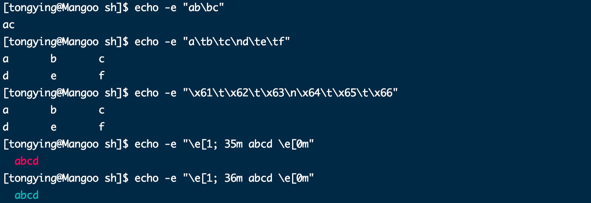

2. 第一个脚本

```
vim hello.sh
```

```shell
#!/bin/bash
# The first programe
# Author: tom
# Date: 2020/04/02

echo -e "Hello World"
```

3. 脚本执行

赋予执行权限，直接运行

```
chmod 755 hello.sh
./hello.sh
```

通过Bash调用脚本执行

```
bash hello.sh
```

如果在Windows上完成的脚本，其换行符与Linux不兼容，可用如下命令进行转换：

```
dos2unix hello.sh
```

### 3. Bash基本功能

#### 3.1 历史命令与命令补全

1. 历史命令

```
history [选项] [历史命令保存文件]
	-c:	清空历史命令
	-w:	把缓存中的历史命令写入历史命令保存文件~/.bash_history
```

历史命令默认会保存10000条，可以在环境变量配置文件/etc/profile中进行修改


历史命令的调用：

```
上下箭头: 调用以前的历史命令
!n:		 重复执行低n条历史命令
!!:		 重复执行上一条命令
!string: 重复执行最后一条以该字串开头的命令
```

2. 命令与文件补全

Tab可以补全命令或文件。

#### 3.2 别名与快捷键

1. 命令别名

```
# 设定命令别名
alias 别名='原命令'
# 查询命令别名
alias
```

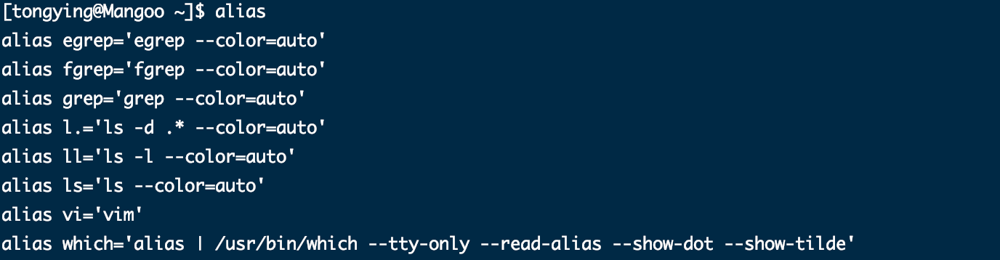

命令执行顺序：

第一顺位：执行用绝对路径或相对路径执行的命令

第二顺位：执行别名

第三顺位：执行Bash的内部命令

第四顺位：执行按照$PATH环境变量定义的目录查找顺序找到的第一个命令

让别名永久生效：

```
vim /home/tom/.bashrc
```


2. Bash常用快捷键

| 快捷键     | 作用                         |
| ---------- | ---------------------------- |
| ctrl+A     | 把光标移动到命令行开头       |
| ctrl+E     | 把光标移到命令行结尾         |
| ==ctrl+C== | 强制终止当前的命令           |
| ==ctrl+L== | 清屏，相当于clear命令        |
| ==ctrl+U== | 删除或或剪切光标之前的命令   |
| ctrl+K     | 删除或剪切光标之后的内容     |
| ==ctrl+Y== | 粘贴ctrl+U或ctrl+K剪切的内容 |
| ==ctrl+R== | 在历史命令中搜索             |
| ==ctrl+D== | 退出当前终端                 |
| ctrl+Z     | 暂停，并放入后台             |
| ctrl+S     | 暂停屏幕输出                 |
| ctrl+Q     | 恢复屏幕输出                 |

#### 3.3 输入输出重定向

1. 标准输入输出

| 设备   | 设备文件名 | 文件描述符 | 类型         |
| ------ | ---------- | ---------- | ------------ |
| 键盘   | /dev/stdin | 0          | 标准输入     |
| 显示器 | /dev/sdout | 1          | 标准输出     |
| 显示器 | /dev/sderr | 2          | 标准出错输出 |

2. 输出重定向

```
标准输出重定向：
	命令 > 文件: 以覆盖的方式，把命令的正确输出输出到指定的文件或设备当中
	命令 >> 文件: 以追加的方式，把命令的正确输出输出到指定的文件或设备当中
标准错误输出重定向：
	错误命令 2> 文件:	把命令的错误输出输出到指定的文件或设备中
	错误命令 2>> 文件:	以追加的方式，把命令的错误输出输出到指定的文件或设备中
```

例如：

```shell
ls > log1		# 把ls的结果保存到log1中
ls >> log1		# 把ls的结果追加到log1中
lst 2> log2		# 把lst的结果保存到log2中
lst 2>> log2	# 把lst的结果追加到log2中
```

3. 正确和错误输出同时保存

| 命令格式                  | 说明                                                     |
| ------------------------- | -------------------------------------------------------- |
| `命令 > 文件 2>&1`        | 以覆盖的方式，把正确输出和错误输出都保存到同一个文件当中 |
| `命令 >> 文件 2>&1`       | 以追加的方式，把正确输出和错误输出都保存到同一个文件当中 |
| `命令 &> 文件`            | 以覆盖的方式，把正确输出和错误输出都保存到同一个文件当中 |
| `命令 &>> 文件`           | 以追加的方式，把正确输出和错误输出都保存到同一个文件当中 |
| `命令 >> 文件1 2>> 文件2` | 把正确的输出追加到文件1中，把错误的输出追加到文件2中     |


例如：

```shell
# 将命令date的正确和错误输出都重定向到log1中（覆盖）
date > log1 2>&1
# 将命令lst的正确和错误输出都重定向到log1中（覆盖）
lst >> log1 2>&1
# 将命令date的正确和错误输出结果都重定向到log2中（覆盖）
date &> log2
# 将命令lst的正确和错误输出结果都重定向到log2中（追加)
lst &>> log2
# 执行date，结果正确则输出到log1，结果错误则输出到log2(追加)
date >> log1 2>> log2
```

4. 输入重定向

```
wc [选项] [文件名]
	-c:	统计字节数
	-w:	统计单词数
	-l: 统计行数
```

wc其实是一个统计命令。

例1：统计`sh/hello.sh`的行数，单词数和字节数


例2: 统计键盘输入的数据中行数，单词数和字节数


#### 3.4 多命令顺序执行与管道符

1. 多命令顺序执行

| 多命令执行符 | 格式             | 作用                                       |
| ------------ | ---------------- | ------------------------------------------ |
| ;            | 命令1; 命令2     | 多个命令顺序执行，命令之间没有任何逻辑联系 |
| &&           | 命令1&&命令2     | 逻辑与，当命令1正确执行，命令2才会执行     |
| \|\|         | 命令1 \|\| 命令2 | 逻辑或，当命令1执行不正确，命令2才会执行   |

例如：`dd`命令可用于拷贝文件或分区

```
dd if=输入文件 of=输出文件 bs=字节数 count=个数
	if=输入文件		指定源文件或源设备
	of=输出文件		指定目标文件或目标设备
	bs=字节数		指定一次输出/输出多少字节，即把这些字节看作一个数据块
	count=个数	 指定输入/输出多少个数据块
```

```shell
date; dd if=/dev/zero of=/root/testfile  bs=1k count=100000;date;ls -lh /root/testfile
```

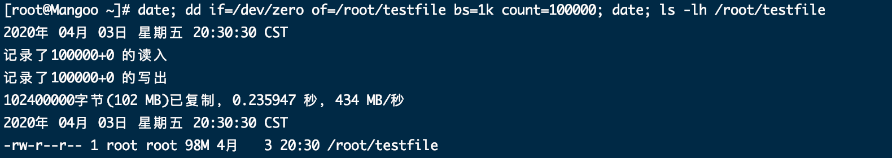

源码安装时可以一步安装

```
./configure && make && make install
```

判断一个命令是否执行正确：

```
命令 && echo yes || echo no
```

2. 管道符

命令格式：

```
# 命令1的正确输出作为命令2的操作对象
命令1 ｜ 命令2
```

例如：

``` shell
ls -a /etc/ | more
netstat -an | grep "ESTABLISHED"
```


grep选项：

```
grep [选项] “搜索内容" 文件名
	-i:	忽略大小写
	-n:	输出行号
	-v:	反向查找
	--color=auto	搜索处的关键字用颜色显示
```


### 4. Bash变量

#### 4.1 用户自定义变量

1. 什么是变量

变量是计算机内存的单元，其中存放的值可以改变。当Shell脚本需要保存一些信息时，如一个文件名或是一个数字，就把它存放在一个变量中。每个变量有一个名字，所以很容易引用它。使用变量可以保存有用信息，使系统获知相关设置，变量也可以用于保存暂时信息。

2. 变量设置规则

 （1）变量名称可以由字母、数字、下划线组成，但是不能以数字开头。如果变量名是"2name”则是错误的。

（2）在Bash中，变量的默认类型是字符串型，如果要进行数值运算，则必须指定变量类型数值型。。

（3）变量用等号连接值，等号左右两侧不能有空格。

（4）变量的值如果有空格，需要使用单引号或双引号包括。

（5）在变量的值中，可以使用“\”转义符。

（6）如果需要增加变量的值，那么可以进行变量值的叠加。不过变量需要用双引号包含`”$变量”`或用`${变量名}`包含。

（7）如果是把命令的结果作为变量值赋予变量，则需要使用反引号或`$()`包含

```
var=$(date)
```

（8）环境变量名建议大写，便于区分。

3. 变量分类

（1）**用户自定义变量**

（2）**环境变量：**这种变量中主要保存的是和操作系统操作环境相关的数据。

（3）**位置参数变量：**这种变量主要是用来向脚本当中传递参数或数据的，变量名不能自定义，变量作用是固定的。

（4）**预定义变量：**是Bash中已经定义好的变量，变量名不能自定义，变量作用也是固定的。

4. 本地变量（用户自定义变量）

定义变量：

```
str1="Hello World"
```

变量叠加：

```
str2="Good morning"
str2="$str2"", Tom."
str2=${str2}", Tom."
```

变量调用：

```
echo $str1
```

变量查看：

```
set
```

变量删除：

```
unset str1
```

例如：


#### 4.2 环境变量

1. 环境变量是什么

用户自定义变量只在当前的Shell中生效，而环境变量会在当前Shell和这个Shell的所有子Shell当中生效。如果把环境变量写入相应的配置文件，那么这个环境变量就会在所有的Shell中生效

例如：

```shell
export name=tom
age=20					# 在子shell中看不到该变量
export sex=male
bash					# 进入子Shell
set						# 查看所有的变量
```


查看进程树：

```
pstree
```

2. 设置环境变量

声明变量：

```
export 变量名=变量值
```

查询变量：

```
env
```

删除变量：

```
unset 变量名
```

3. `PATH`

PATH：系统查找命令的路径


PATH变量叠加：

```
PATH="$PATH":/home/tongying/sh
```

PATH变量叠加后，就能找到`/home/tongying/sh`下的`hello.sh`，可以不用加路径就能运行`hello.sh`，临时生效。

4. `PS1`

PS1：定义系统提示符变量

 ```
\d:	显示日期，格式为“星期 月 日”
\h:	显示简写主机名。如默认主机名“localhost”
\t:	显示24小时制时间，格式为"HH:mm:ss"
\T:	显示12小时制时间，格式为"hh:mm:ss"
\A:	显示24小时制时间，格式为"HH:mm"
\u:	显示当前用户名
\w:	显示当前所在目录的完整名称
\W:	显示当前所在目录的最后一个目录
\#:	执行的第几条命令
\$: 提示符。如果是root用户会显示提示符为“#”，如果是普通用户会显示提示符为"$"
 ```

例如：

```shell
PS1='[\u@\t \W]\$ '		# [用户名@主机名 简写目录]$ 
PS1='[\u@\h \t \w]\$ '	# [用户名@主机名 时间 完整目录]$ 
PS1='[\u@\h \W]\$ '		# [用户名$主机名 简写目录]$ 
```


查看`PS1`：

```shell
echo $PS1
set | grep "PS1"
```

#### 4.3 位置参数变量

1. 位置参数变量

| 位置参数变量 | 作用                                                         |
| ------------ | ------------------------------------------------------------ |
| `$n`         | n为数字，$0代表命令本身，$1~$9代表第1到第9个参数，第10个及以后的参数需要用大括号括起来，如：${10} |
| `$*`         | 这个变量代表命令行中所有的参数，$*把所有的参数看成一个整体   |
| `$@`         | 这个参数代表命令行中所有的参数，不过$@把每个参数区分对待     |
| `$#`         | 代表命令行中所有参数的个数（不包含命令本身）                 |

例1：接收3个参数并输出

```shell
#!/bin/bash
echo $0
echo $1
echo $2
echo $3
```


例2：接收两个参数，并计算它们的和

```shell
#!/bin/bash
# Shell脚本中想要进行计算必须用$(())括起来
echo "$1 + $2 = $(($1 + $2))"
```


例3：输出命令行中的参数个数及所有的参数

```shell
#!/bin/bash
echo "The number of parameter: $#"
echo "All parameters: $*"
echo "All parameters: $@"
```


例4：`$*`和`$@`的区别

```shell
#!/bin/bash
# $*中所有参数看作一个整体，所以这个for循环只会循环一次
for i in "$*"
    do
        echo "The parameters is: $i"
    done
x=1
# $@中每个参数都看成是独立的，所以$@中有几个参数，就会循环几次
for y in "$@"
    do
        echo "The parameter$x is: $y"
        x=$(($x + 1))
    done
```


#### 4.4 预定义变量

| 预定义变量 | 作用                                                         |
| ---------- | ------------------------------------------------------------ |
| $?         | 最后一次执行的命令的返回状态。如果这个变量的值为0，证明上一个命令执行正确，如果这个变量的值为非0（具体的值由命令决定），则证明上一个命令执行不正确 |
| $$         | 当前进程的进程号（PID）                                      |
| $!         | 后台运行的最后一个进程的进程号（PID）                        |

例如：查看执行脚本的进程的PID和上一个后台进程的PID

```bash
#!/bin/bash

#  输出当前进程PID
# 这个PID就是param5.sh这个脚本执行时，生成的进程PID
echo "Current process is $$"

# 使用find命令在/home/tongying目录下查找hello.sh文件
# &符号的意思是把命令放入后台执行，
find /home/tongying -name hello.sh &
echo "The last Daemon process is $!"
```


2. 接收键盘输入

```
read [选项] [变量名]
	-p “提示信息”: 在等待read输入时，输出提示信息
	-t 秒数: read命令会一直等待命令输入，使用此选项可以指定等待时间
	-n 字符数: read命令只接收指定的字符数，就会执行
	-s: 隐藏输入的数据，适用于机密信息的输入
```

例如：接收键盘输入并输出

```shell
#!/bin/bash
# 提示"请输入姓名"并等待30S，把用户的输入保存到变量name中
read -t 30 -p "Please enter your name: " name
echo "Your name is $name."

# 用-s选项隐藏输入
read -s -t 30 -p "Please enter your age: " age
echo -e "\n"
echo "Your age is $age."

# 使用-n 1选项只输入一个字符就会执行（都不用输入回车）
read -n 1 -t 30 -p "Please select your gender[M/F]: " gender
echo -e "\n"
echo "Your gender is $gender."
```


### 5. Bash运算符

#### 5.1 数值运算与运算符

1. declare变量声明

```
declare [+/-] [选项] 变量名
	-:	给变量设定类型属性
	+:	取消变量的类型属性
	-i:	将变量设定为整数型（integer）
	-x:	将变量声明为环境变量
	-p:	显示指定变量的被声明的类型
```

例子：

```shell
# 给变量aa和bb赋值
aa=11
bb=22
declare -i cc=$aa+$bb
```


2. expr或let数值运算工具

```shell
# 给变量aa和bb赋值
aa=11
bb=22
# dd的值是aa和bb的和，注意“+”号左右两侧必须有空格
dd=$(expr $aa + $bb)
```


3. "`$((运算式))`"或”`$[运算式]`”

```
aa=11
bb=22
ff=$(($aa+$bb))
gg=$[$aa+$bb]
```


4. 运算符

| 优先级 | 运算符                                         | 说明                               |
| ------ | ---------------------------------------------- | ---------------------------------- |
| 13     | -, +                                           | 单目负、单目正                     |
| 12     | !, ~                                           | 逻辑非、按位取反或补码             |
| 11     | *,  /, %                                       | 乘、除、取模                       |
| 10     | +, -                                           | 加、减                             |
| 9      | <<, >>                                         | 按位左移、按位右移                 |
| 8      | <=, >=, <, >                                   | 小于或等于、大于或等于、小于、大于 |
| 7      | ==, !=                                         | 等于、不等于                       |
| 6      | &                                              | 按位与                             |
| 5      | ^                                              | 按位异或                           |
| 4      | \|                                             | 按位或                             |
| 3      | &&                                             | 逻辑与                             |
| 2      | \|\|                                           | 逻辑或                             |
| 1      | =, +=, -, =, *=, /=, %=, &=, ^=, \|=, <<=, >>= | 赋值、运算且赋值                   |

数字越大优先级高。

#### 5.2 变量测试与内容替换

| 变量置换方式   | 无y变量          | 变量y为空值      | 变量y设置值   |
| -------------- | ---------------- | ---------------- | ------------- |
| `x=${y-新值}`  | x=新值           | x为空            | x=$y          |
| `x=${y:-新值}` | x=新值           | x=新值           | x=$y          |
| `x=${y+新值}`  | x为空            | x=新值           | x=新值        |
| `x=${y:+新值}` | x为空            | x为空            | x=新值        |
| `x=${y=新值}`  | x=新值, y=新值   | x为空, y值不变   | x=$y, y值不变 |
| `x=${y:=新值}` | x=新值, y=新值   | x=新值, y=新值   | x=$y, y值不变 |
| `x=${y?新值}`  | 新值输出到stderr | x为空            | x=$y          |
| `x=${y:?新值}` | 新值输出到stderr | 新值输出到stderr | x=$y          |
|                |                  |                  |               |

例1：测试`x=${y-新值}`

```shell
unset aa
bb=${aa-new}
aa=""
bb=${aa-new}
aa=11
bb=${aa-new}
```


例2：测试`x=${y+新值}`

```shell
unset cc
dd=${cc+new}
cc=""
dd=${cc+new}
cc=22
dd=${cc+new}
```


用`if`它不香吗。

### 6. 环境变量配置文件

#### 6.1 简介

1. `source`命令

```
source 配置文件
[或]
. 配置文件
```

让环境变量配置立即生效，省略重启过程。

2. 环境变量配置文件简介

环境变量配置文件中主要是定义对系统的操作环境生效的系统默认环境变量，比如PATH、HISTSIZE、PS1、HOSTNAME等默认环境变量。

```
/etc/profile				
/etc/profile.d/*.sh
~/bash_profile
~/.bashrc
/etc/bashrc
```

/etc目录下的环境变量配置文件对所有的用户生效，～/目录下的环境变量配置文件只对当前用户生效。

#### 6.2 作用



1. /etc/profile的作用

```
USER变量:
LOGNAME变量:
MAIL变量:
PATH变量:
HOSTNAME变量:
HISTSIZE变量:
umask:
调用/etc/profile.d/*.sh文件
```

2. ~/.bash_profile的作用

```
调用~/.bashrc
将家目录下的bin目录加入到PATH
```

3. ～/.bashrc的作用

```
别名
调用/etc/bashrc
```

4. /etc/bashrc的作用

```
PS1
umask						# non-login shell
PATH变量					   # non-login shell
调用/etc/profile.d/*.sh文件	  # non-login shell
```

#### 6.3 其他配置文件和登录信息

1. 注销时生效的环境变量配置文件

```
~/.bash_logout
```

2. 其他配置文件

```
~/bash_history
```

保存当前用户敲过的所有历史命令，不过最近敲的命令在内存里，还没刷出去。 所以`histroy`与`vim ~/bash_history`会不一样

3. Shell登录信息

本地终端欢迎信息：`/etc/issue`

| 转义符 | 作用                     |
| ------ | ------------------------ |
| \d     | 显示当前系统时间         |
| \s     | 显示操作系统名称         |
| \l     | 显示登录的终端号         |
| \m     | 显示硬件体系结构         |
| \n     | 显示主机名               |
| \o     | 显示域名                 |
| \r     | 显示内核版本             |
| \t     | 显示当前系统时间         |
| \u     | 显示当前用户登录的序列号 |

远程终端欢迎信息：`/etc/issue.net`

## 八、Shell编程

### 1. 正则表达式

1. 正则表达式与通配符

正则表达式用来在文件中匹配符合条件的字符串，正则是包含匹配。`grep`、`awk`、sed等命令可以支持正则表达式

通配符用来匹配符合条件的文件名，通配符石完全匹配。`ls`、`find`、`cp`这些命令不支持正则表达式，所以只能使用shell自己的通配符来进行匹配了。

2. 基础正则表达式

| 元字符    | 作用                                                         |
| --------- | ------------------------------------------------------------ |
| *         | 前一个字符匹配0次或者任意多次                                |
| .         | 匹配除了换行符外任意一个字符                                 |
| ^         | 匹配行首。如：`^hello`会匹配以hello开头的行                  |
| $         | 匹配行尾。如：`hello&`会匹配以hello结尾的行                  |
| []        | 匹配中括号中指定的任意一个字符，只匹配一个字符。如：[aeiou]匹配任意一个元音字母，[0-9]匹配任意一位数字，[a-z]\[0-9]匹配小写字和一位数字构成的两位字符。 |
| [^]       | 匹配除中括号的字符以外的任意一个字符。如：[\^0-9]匹配任意一位非数字字符，[\^a-z]表示任意一位非小写字母。 |
| \         | 转义符。                                                     |
| \\{n\\}   | 表示其前面的字符恰好出现n次。如：[0-9]\\{4}\\匹配4位数字，[1]\[3-8]\[0-9]\\{9\\}匹配手机号码 |
| \\{n,\\}  | 表示其前面的字符出现不小于n次。例如：[0-9]\\{2,\\}表示两位及以上的数字 |
| \\{n,m\\} | 表示其前面的字符至少出现n次，最多出现m次。例如[a-z]\\{6,8\\}匹配6-8位的小写字母 |

例如：

`*`前一个字符出现0次或者任意多次

```shell
# 匹配所有内容，包括空白行
grep "a*" regex_test.txt
# 匹配至少包含一个a的行
grep "aa*" regex_test.txt
# 匹配最少包含两个连续的啊的行
grep "aaa*" regex_test.txt
```

`.`匹配除了换行符以外任意一个字符

```shell
# 匹配在w和d这两个字母之间一定有3个字符的单词所在行
grep "w...d" regex_test.txt
# 匹配在w和d字母之间有任意字符
grep "w.*d" regex_test.txt
# 匹配所有内容
grep ".*" regex_test.txt
```


 `^`匹配行首，`$`匹配行尾

```bash
# 匹配以大小A开头的行
grep "^A" regex_test.txt
# 匹配以句号.结尾的行
grep "\.$" regex_test.txt
# 会匹配空白行
grep -n "$^" regex_test.txt
```

`[]`匹配括号中指定的任意一个字符，只匹配一个字符

```shell
# 匹配s和i字符中，要不是a要不是o
grep "s[ao]id" regex_test.txt
# 匹配任意一个数字
grep "[0-9]" regex_test.txt
# 匹配用小写字母开头的行
grep "^[a-z]" regex_test.txt
```

`[^]`匹配除中括号的字符以外的任意一个字符

```shell
# 匹配不用小写字母开头的行
grep "^[^a-z]" regex_test.txt
# 匹配不用字母开头的行
grep "^[^a-zA-Z]" regex_test.txt
```

`\{n\}`表示其前面的字符恰好出现n次

```shell
# 匹配a字母连续出现3次的字符串
grep "a\{3\}" regex_test.txt
# 匹配包含至少3个连续数字的字符串
grep "[0-9]\{3,\}" regex_test.txt
```

`{n,m\}`匹配其前面的字符至少出现n次，最多出现m次

```shell
# 匹配在字母s和字母i之间最少一个a，最多3个a
grep "sa\{1,3\}i" regex_test.txt 
```

###  2. 字符截取命令

#### 2.1 `cut`字段提取命令

```
cut [选项] 文件名
	-f 列号:	 提取第几列
	-d 分隔符:	按照指定分隔符分割列
```

例如：


```shell
cut -f 2,3 student.txt
```


```shell
cut -d ":" -f 1,3 /etc/passwd
```


提取所有的普通用户用于批量删除：

```shell
cat /etc/passwd | grep /bin/bash | grep -v root | cut -d ":" -f 1
```


`cut`的局限：

列于列之间必须按照严格的分隔符进行分割，如“:”或TAB，否则不能得到正确的结果。

#### 2.2 `printf`

命令格式：

 ```
printf '输出类型输出格式' 输出内容
 ```

输出类型：

```
%ns:	输出字符串。n是数字代表输出几个字符
%ni:	输出整型。n是数字代表输出几个数字
%m.nf:	输出浮点数。m和n是数字，代表输出的整数位数和小数位数。如%8.2f代表共输出8位数，其中2位是小数，6位是整数。
```

输出格式：

```
\a:		输出警告声音
\b:		输出退格键，也就是Backspace键
\f:		清除屏幕
\n:		换行
\r:		回车，也就是Enter键
\t:		水平输出Tab键
\v:		垂直输出Tab键
```

 例如：

```
# 输出为一行
printf  %s 1 2 3 4 5 6
# 会将后两个%s原样输出
prinrf %s %s %s 1 2 3 4 5 6
# 3个为一组
printf '%s %s %s' 1 2 3 4 5 6
# 3个为一组并且换行
printf '%s %s %s\n' 1 2 3 4 5 6
```


用printf输出文件内容：

```shell
# 不调整格式
printf '%s' $(cat student.txt)
# 调整格式输出
printf '%s\t %s\t %s\t %s\n' $(cat student.txt)
```


 在`awk`命令的输出中支持`print`和`printf`命令

`print:` print会在每个输出之后自动加入一个换行符（Linux默认莫有print命令）。

`printf:` printf是标准格式输出命令，并不会自动加入换行符，如果需要换行，需要手工加入换行符。

#### 2.3 `awk`

命令格式：

```
awk '条件1{动作1} 条件2{动作2}...' 文件名
```

条件：

```
一般使用关系表达式作为条件：
x>10
x>=10
x<=10
```

动作（Action）：

```
格式化输出
流程控制语句
```

例如：

 

```shell
# 输出第2列和第6列，$0代表整个一行
awk '{printf $2"t" $6"\n"}' student.txt
```


`awk`命令虽然是提取列，但是是把数据一行一行读入再按格式进行处理。 

例如：提取文件系统占用情况

```shell
# 注意这里使用的是print，自动加换行符
df -h | awk '{print $1"\t" $3}'
```


 例如：提取某分区系统占用百分比

```shell
df -h | grep vda1 | awk '{print $5}' | cut -d "%" -f 1
```


 

- **BEGIN**

表示先执行一次BEGIN后跟的动作，再执行其他动作

```
awk 'BEGIN{printf "This is a transcript\n"} {printf $2"\t" $5"\n"}' student.txt
```

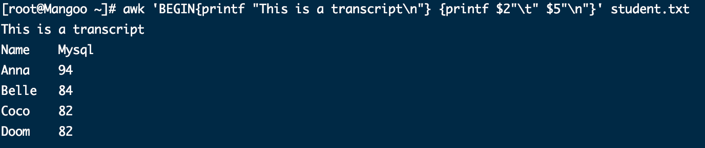

- **FS内置变量**

指定分隔符

例如：截取普通用户的用户名和uid

```shell
cat /etc/passwd | grep "/bin/bash" | awk 'BEGIN{FS=":"} {print $1 "\t" $3 "\n"}'
```

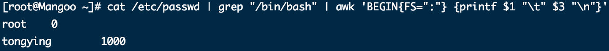

  如果不加BEGIN会怎么样呢？

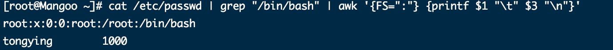

第一行没有被处理到，因为awk命令是先读入数据，再去匹配后面的条件，第一行读入时还没有指定分隔符，还是按照默认的制表符或者空格来分割。

- **END**

 在所有的数据都处理完之后，再处理END后面的动作

```shell
cat /etc/passwd | grep "/bin/bash" | awk 'BEGIN{FS=":"} END{print "~~Done~~"} {printf $1 "\t" $3 "\n"}'
```

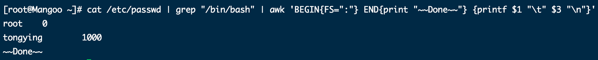

- **关系运算符**

筛选平均成绩大于90分的同学

```shell
 cat student.txt | grep -v 'Name' | awk '$6 >= 90 {printf $2 "\t" $6 "\n"}'
```


####  2.4 `sed`

 `sed`是一种几乎包括在所有的UNIX平台（包括Linux）的轻量级流编辑器。sed主要用来将数据进行选取、替换、删除、新增的命令

`sed`命令格式：

```
sed [选项] '[动作]' 文件名
```

选项：

```
-n:		一般sed命令会把所有数据都输出到屏幕，如果加入此选择，则只会把经过sed命令处理的行输出到屏幕
-e:		允许对输入数据应用多条sed命令编辑
-i:		用sed的修改结果直接修改读取数据的文件，而不是由屏幕输出
```

动作：

```
a\:	追加，在当前行后添加一行或多行。添加多行时，除最后一行外，每行末尾需要用"\n"代表数据未完结
c\:	行替换，用c后面的字符串替换原数据行，替换多行时，除最后一行外，每行末尾需用"\n"代表数据未完结
i\:	插入，在当前行前插入一行或多行。插入多行时，除最后一行外，每行末尾需要用"\n"代表数据未完结
d:	删除，删除指定的行
p:	打印，输出指定的行
s:	字串替换，用一个字符串替换另外一个字符串，格式为"行范围s/旧字串/新字串/g"（和vim中的替换格式类似）
```

 例如：


 ```shell
# 查看文件第二行
sed -n '2p' student.txt
 ```


```shell
# 也可以放在管道符之后
df -h | sed -n '2p'
```


```shell
# 删除第2到第3行，不修改原文件
 sed -n '2,3d' student.txt
```


```shell
# 在第二行后追加hello
sed '2a hello' student.txt
```


```shell
# 在第二行前插入两行数据
sed '2i hello \
world' student.txt
```


```shell
# 数据替换
sed '3c No such person' student.txt
```


字串替换：`sed ‘s/旧字串/新字串/g’ 文件名`

```shell
# 在第3行中，将84替换为89
sed '3s/84/89/g' student.txt
# sed操作的数据直接写入文件
sed -i '3s/84/89/g' student.txt
# 同时把Coco替换为Lily,把Doom替换为Nancy
sed -e 's/Coco/Lily/g; s/Doom/Nancy/g' student.txt
```


###   3. 字符处理命令

1. 排序命令`sort`

```
sort [选项] 文件名
	-f:	忽略大小写
	-n:	以数值型进行排序，默认使用字符串型排序
	-r:	反向排序
	-t:	指定分隔符，默认的分隔符是制表符
	-k n[,m]:	按照指定的字段范围排序。从第n字段开始，m字段结束（默认到行尾）
```

  例如：

```shell
# 排序用户信息文件
sort /etc/passwd
# 反向排序
sort -r /etc/passwd
# 指定分隔符是":"，并用第三个字段排序
sort -t ":" -k 3,3 /etc/passwd
# 第三个字段按数值型排序
sort -n -t ":" -k 3 3 /etc/passwd
```

2. 统计命令`wc`

```
wc [选项] 文件名
	-l:		只统计行数
	-w:		只统计单词数
	-m:		只统计字符数
```

例如：


## 九、Linux服务管理

### 1. 服务分类




- **启动与自启动**

  服务启动：就是在当前系统中让服务运行，并提供功能。

服务自启动：自启动时指让服务在系统开机或重启之后，随着系统的启动而自动启用服务。

- **查询已安装的服务**

RPM包安装的服务：

```
# 查看服务自启动状态，可以看到所有RPM包安装的服务
chkconfig --list
```

源码包安装的服务：

```
查看服务安装位置，一般是/usr/local/下
```


「注：0～6代表系统运行级别——0关机，1单用户，2不完全多用户，3完全多用户，4未分配，5图形界面，6重启」

- **RPM安装服务和源码包安装服务的区别**

安装位置的不同。

```
源码包安装在指定位置，一般是/usr/local/
RPM包安装在默认位置中
```

### 2. RPM服务的管理

####  2.1 独立服务管理

1. RPM包默认安装的位置：

 ```
/etc/init.d/:	启动脚本位置
/etc/sysconfig/:	初始化环境配置文件位置
/etc/:	配置文件位置
/etc/xinetd.conf:	xinet配置文件
/etc/xinetd.d/:		基于xinetd服务的启动脚本
/var/lib/:	服务产生的数据放在这里
/var/log/:	日志
 ```

2. 独立服务的启动

```
/etc/init.d/独立服务名 start|stop|status|restart
```

或

```
# Red Hat专用
service 独立服务名 start|stop|status|restart
```

查看所有RPM包安装的服务的状态：

```
service --status-all
```

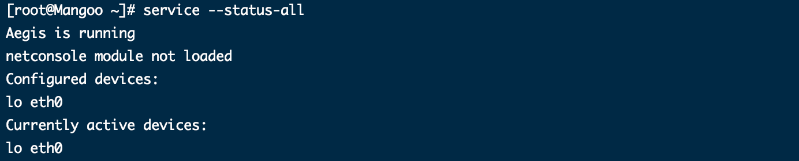 

3. 独立服务的自启动

```
chkconfig [--level 运行级别] [独立服务名] [on|off]
```

或

```
# 推荐
修改/etc/rc.d/rc.local文件
```

或

```
# 可视化窗口管理，红帽专用
ntsysv
```

#### 2.2 基于xinetd服务的管理

1. 安装xinetd与telnet

```shell
yum -y install xinetd
yum -y install telnet-server
```

centOS7安装telnet后xinetd下面并没有找到：


2. xinetd服务的启动

那就看一下tcpmux吧

```
vim /etc/xinetd.d/tcpmux
```

```shell
# 服务的名称
service tcpmux
{
# This is for quick on or off of the service
        disable         = yes
# The next attributes are mandatory for all services
        id              = tcpmux-server
        type            = INTERNAL
        wait            = no
        socket_type     = stream
#       protocol        =  socket type is usually enough

# External services must fill out the following
#       user            = root
#       group           =
#       server          =
#       server_args     =

# External services not listed in /etc/services must fill out the next one
#       port            =

# RPC based services must fill out these
#       rpc_version     =
```

重启xinetd

```
service xinetd start
```

3. xinetd服务的自启动

```
chkconfig telnet on
```

或

```
ntsysv
```

xinetd服务的启动和自启动是绑定的。

### 3. 源码包服务的管理

1. 源码包安装服务的启动

使用绝对路径，调用启动脚本来启动。不同的源码包的启动脚本不同。可以查看源码包的安装说明，查看启动脚本的方法。

```
/usr/local/apache2/bin/apachectl start|stop
```

2. 源码包服务的自启动

```
vim /etc/rc.d/rc.local
加入
/usr/local/apache2/bin/apachectl start
```

3. 让源码包服务被服务管理命令识别

让源码包的apache服务能被service命令启动

```
ln -s /usr/local/apache2/bin/apachectl /etc/init.d/apache
```

   让源码包的apache服务能被chkconfig与ntsysv命令管理自启动

```
vim /etc/init.d/apache额
##### 指定httpd脚本可以被chkconfig命令管理。格式：
##### chkconfig: 运行级别 启动顺序 关闭顺序
#chkconfig: 35 86 76
##### 说明，内容随意
# description: source package apache
```

如何确定系统的启动和关闭顺序？

不能与系统已经存在的服务的启动和关闭顺序相冲突，在/etc/rc.d/下面有rc0.d~rc6.d几个目录，数字代表系统运行级别，相应目录下就有服务的启动和关闭顺序。


将应用加入到chkconfig可以识别：

```
# 把源码包apache加入到chkconfig命令
chkconfig --add apache
```

### 4. 服务管理总结

1. 服务的分类与管理

 

## 十、Linux系统管理

### 1. 进程管理

#### 1.1 进程查看

1. 进程简介

进程是正在执行的一个程序或命令，每一个进程都是一个运行的实体，都有自己的地址空间，并占用一定的系统资源。

```
ls产生了一个进程，只是结束得比较快
```

2. 进程管理的作用

判断服务器健康状态。

查看系统中所有进程。

杀死进程。

3. 查看系统中所有进程

```
# 查看系统中所有进程，使用BSD操作系统格式
ps aux
# 查看系统中所有进程，使用Linux标准命令格式
ps -le
```

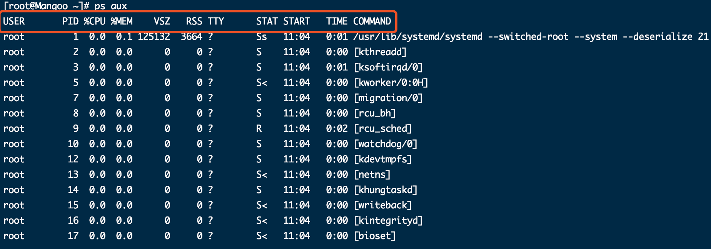

```
[USER]:	该进程是由哪个用户产生的
[PID]:	进程的ID号
[%CPU]:	该进程占用CPU资源的百分比，占用越高，进程越耗费资源
[%MEM]:	该进程占用物理内存的百分比，占用越高，进程越耗费资源
[VSZ]:	该进程占用虚拟内存的大小，单位KB
[RSS]:	该进程占用实际物理内存的大小，单位KB
[TTY]:	该进程是在哪个终端中运行的，其中tty1-tty7代表本地控制终端，tty1-tty6是本地字符界面终端，tty7是图形终端，pts/0-255代表虚拟终端
[STAT]:	进程状态。常见的状态有：R——运行，S——睡眠，T——停止状态，s——包含子进程，+——位于后台
[START]: 该进程的启动时间
[TIME]:	 该进程占用CPU的运算时间，注意不是系统时间
[COMMAND]:	产生此进程的命令名
```

4. 查看系统健康状态

```
top [选项]
# 选项：
	-d 秒数:	指定top命令每隔几次更新，默认是3秒
# 在top命令的交互模式中可以执行的命令：
	?或h:	显示交互模式的帮助
	P:		以CPU的使用率排序，默认就是此项
	M:		以内存的使用率排序
	N:		以PID排序
	q:		退出
```

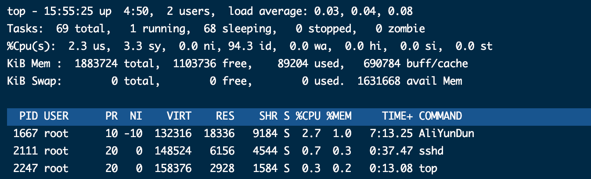

第一行信息为任务队列消息

| 内容                           | 说明                                                         |
| ------------------------------ | ------------------------------------------------------------ |
| 15:55:25                       | 系统当前时间                                                 |
| up 4:50                        | 系统的运行时间，本机已运行4小时50分钟                        |
| 2 users                        | 当前登录了两个用户                                           |
| load average: 0.03, 0.04, 0.08 | 系统在之前1分钟、5分钟、15分钟的平均负载，一般认为小于1时负载较小，如果大于1，系统已经超出负荷 |

第二行为进程消息

| 内容            | 说明                                      |
| --------------- | ----------------------------------------- |
| Tasks: 69 total | 系统中的进程总数                          |
| 1 running       | 正在运行的进程数                          |
| 68 sleeping     | 睡眠的进程                                |
| 0 stopped       | 正在停止的进程                            |
| 0 zombie        | 僵尸进程。如果不是0，需要手工检查僵尸进程 |

第三行为CPU信息

| 内容           | 说明                                                         |
| -------------- | ------------------------------------------------------------ |
| %Cpu(s): 2.3us | 用户模式占用的CPU百分比                                      |
| 3.3 sy         | 系统模式占用的CPU百分比                                      |
| 0.0 ni         | 改变过优先级的用户进程占用的CPU百分比                        |
| 94.3 id        | 空闲CPU的CPU百分比                                           |
| 0.0 wa         | 等待输入/输出的进程占用的CPU百分比                           |
| 0.0 hi         | 硬中断请求服务占用的CPU百分比                                |
| 0.0 si         | 软中断请求占用的CPU百分比                                    |
| 0.0 st         | St(Steal time)虚拟时间百分比，就是当有虚拟机时，虚拟CPU等待实际CPU的时间百分比 |

第4行为物理内存信息

| 内容               | 说明                     |
| ------------------ | ------------------------ |
| Mem: 1883724 total | 物理内存的总量，KB       |
| 1103736 free       | 空闲的物理内存数量       |
| 89204 used         | 已经使用的物理内存数量   |
| 690784 buff/cache  | 作为buff/cache的内存数量 |

第5行为交换分区信息

| 内容              | 说明                       |
| ----------------- | -------------------------- |
| Swap: 0 total     | 交换分区虚拟内存）的总大小 |
| 0 free            | 空闲交换分区的大小         |
| 0 used            | 已经使用的交换分区的大小   |
| 1631668 avail Mem | 作为缓存的交互分区的大小   |

5. 查看进程数

```
pstree [选项]
	-p:	显示进程的pid
	-u:	显示进程的所属用户
```

PID为1的进程： CentOS 6——/sbin/init，CentOS7——symtemd

#### 1.2 进程管理

1. `kill`命令

查看可用的进程信号：

```
kill -l
```

| 信号代号 | 信号名称 | 说明                                                         |
| -------- | -------- | ------------------------------------------------------------ |
| 1        | SIGHUP   | 该信号让进程立即关闭，然后重新读取配置文件之后重启           |
| 2        | SIGINT   | 程序终止信号，用于终止前台程序，相当于输出CTRL+C快捷键       |
| 8        | SIGFPE   | 在发生致命的算数运算错误时发出，不仅包括浮点运算错误，还包括溢出及除数为0等其他所有的算术的错误 |
| 9        | SIGKILL  | 用来立即结束程序的运行，本信号不能被阻塞、处理和忽略。一般用于强制终止进程 |
| 14       | SIGALRM  | 时钟定时信号，计算的是实际的时间或时钟时间，alarm函数使用该信号 |
| 15       | SIGTERM  | 正常结束进程的信号，kill命令的默认信号。有时如果进程已经发生问题，这个信号是无法正常终止进程的，我们才会尝试SIGKILL信号，也就是9 |
| 18       | SIGCONT  | 该信号可以让暂停的进程恢复执行，本信号不能被阻断             |
| 19       | SIGSTOP  | 该信号可以暂停前台进程，相当于输入CTRL+Z快捷键。本信号不能被阻断。 |

杀死进程：

```
kill pid
```

「注意：杀死父进程，子进程也跟着结束」

例如：


```shell
# 强制终止进程
kill -9 12327
# 重启进程
kill -1 12324
```

2. `killall`命令

```
# 按照进程名杀死进程
killall [选项] [信号] 进程名
# 选项:
	-i:	交互式，询问是否要杀死某个进程
	-I:	忽略进程名的大小写
```

例如：

```shell
killall -9 httpd
```

3. `pkill`命令

```
# 按照进程名终止进程
pkill [选项] [信号] 进程名
# 选项:
	-t 终端号:		按照终端号踢出用户
```

例如：终止apache服务

```shell
pkill -9 httpd
```

例如：按照终端号踢出用户

```shell
# 用w命令查询本机已经登录的用户
w
# 强制踢出从pts/2虚拟终端登录的用户
pkill -t -9 pts/2
```

连自己都能踢。

### 2. 工作管理

1. 把进程放入后台

```
# 后台运行
tar -zcf etc.tar.gz /etc &
# 后台暂停
top 按下 CTRL + Z
```

2. 查看后台的工作

```
jobs [-l]
# 选项：
-l:	显示工作的PID
```


「注」：+号代表最近一个放入后台的工作，也是工作恢复时默认恢复的工作，-代表倒数第二个放入后台的工作。

3. 将后台暂停的工作恢复到前台执行

```
fg %工作号
# 参数：
	%工作号:	%可省略，但是注意工作号和PID的区别
```

4. 将后台暂停的工作恢复到后台执行

```
bg %工作号
```

「注」：后台恢复执行的工作是不能与前台有交互的，否则不能恢复到后台执行。

像`top`、`vim`等就不能放入后台继续执行。

### 3. 系统资源查看

#### 3.1 `vmstat`

监控系统资源

```
vmstat [刷新延时 刷新次数] 
```

例如：

```shell
vmstat 2 3
```


#### 3.2 `dmesg`

开机时内核检测信息。

```shell
dmesg
```

例如：

```shell
dmesg | grep CPU
```

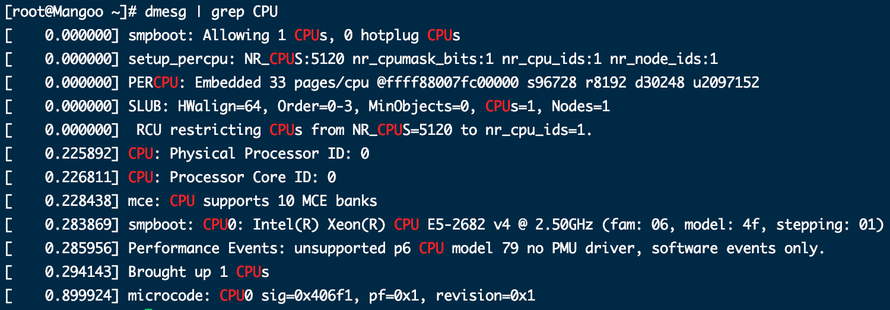


问：怎么查看电脑的硬件信息？

```
dmesg
```

#### 3.3 `free`

查看内存使用状态

```
free [-b|-k|-m|-g]
# 选项：
	-b:	以字节为单位显示
	-k:	以kb为单位显示，默认就是以kb为单位显示
	-m:	以MB为单位显示
	-g:	以GB为单位显示
```

例如：

```shell
free -m
```


上图中：total = used + free + buff/cache

- **缓冲和缓存的区别**

简单来说缓存（cache）是用来加速数据从硬盘中“读取”的，而缓冲（buffer）是用来加速数据写入硬盘的。

#### 3.4 `cat /proc/cpuinfo`

查看CPU信息

```
cat /proc/cpuinfo
```

例如：

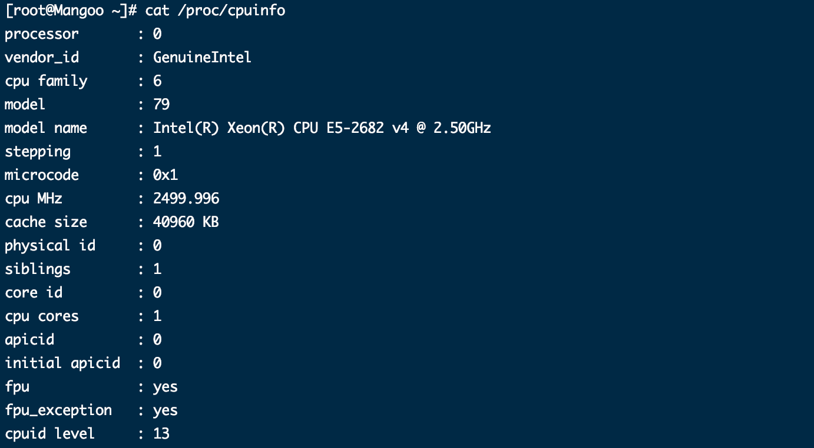

#### 3.5 `uptime`

显示系统启动时间和平均负载，也就是`top`命令的第一行。`w`命令也可以看到这个数据。

```
uptime
```

例如：


#### 3.6 `uname`

查看系统与内核信息。

```
uname [选项]
# 选项：
	-a:	查看系统所有相关信息
	-r:	查看内核版本
	-s:	查看内核名称
```

例如：

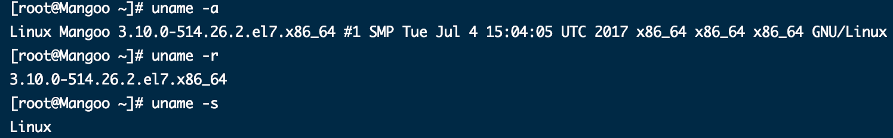

#### 3.7 `file /bin/ls`

判断当前系统位数。

```
file /bin/ls
```

例如：


任何一个Linux外部命令都可以。

```shell
file /bin/ls
file /bin/cp
```

#### 3.8 `lsb_release -a`

查询当前Linux系统的发行版本。

```
lsb_release -a
```

例如：

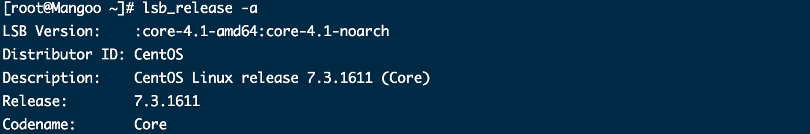


#### 3.9 `lsof`

列出进程调用或打开的文件的信息。

```
lsof [选项]
# 选项
	-c 字符串:	只列出以字符串开头的进程打开的文件
	-u 用户名:	只列出某个用户的进程打开的文件
	-p pid:	只列出某个PID打开的文件
```

例如：

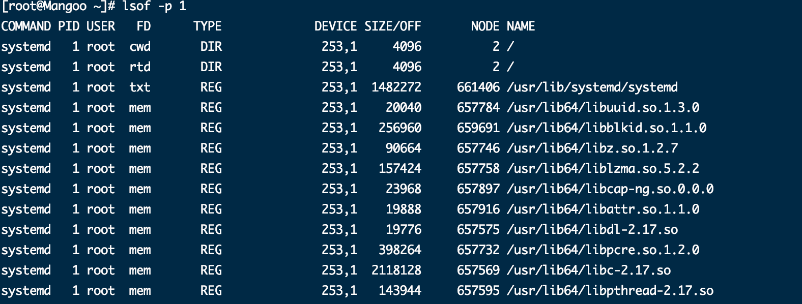

### 4. 系统定时任务

1. crond服务管理与访问控制

```
service crond start
chkconfig crond on
```

系统默认crond是启动以及自启动的，一般不需要手工管理。


2. 用户的crontab设置

```
crontab [选项]
# 选项：
-e:	编辑crontab定时任务
-l:	查询crontab任务
-r:	删除当前用户所有的crontab任务
```

`crontab -e`进入crontab编辑界面，会打开vim编辑工作，格式：

```
* * * * * 执行的任务
```

| 项目      | 含义                 | 范围             |
| --------- | -------------------- | ---------------- |
| 第一个“*” | 一个小时中的第几分钟 | 0-59             |
| 第二个“*” | 一天中的第几个小时   | 0-23             |
| 第三个“*” | 一个月当中的第几天   | 1-31             |
| 第四个“*” | 一年当中的第几个月   | 1-12             |
| 第五个“*” | 一周当中的星期几     | 0和7都表示星期天 |


| 特殊符号 | 含义                                                         |
| -------- | ------------------------------------------------------------ |
| *        | 代表任何时间。比如第一个“*”就代表一小时中每分钟执行一次的意思 |
| ,        | 代表不连续的时间。比如“0 8,12,16 * * * 命令”，代表每天的8:00, 12:00, 16:00都执行一次命令 |
| -        | 代表连续的时间范围。比如“0 5 * * 1-6 命令”，代表周一到周六的5:00 执行命令 |
| */n      | 代表每隔多久执行一次。比如“*/10 * * * * 命令”，代表每隔10分钟就执行一次命令。 |

例如：

| 时间              | 含义                                                         |
| ----------------- | ------------------------------------------------------------ |
| 45 22 * * * 命令  | 在每天的22点45分执行命令                                     |
| 0 17 * * 1 命令   | 在每周一的17点0分执行命令                                    |
| 0 5 1,15 * * 命令 | 每月1号和15号的凌晨5点0分执行命令                            |
| 40 4 * * 1-5 命令 | 在每周一到周五的凌晨4点40分执行命令                          |
| */10 4 * * * 命令 | 每天的4点，每个10分钟执行一次命令                            |
| 0 0 1,15 * 1 命令 | 每月1号和15号、每周一的0点0分都会执行命令，注意，星期几和几号最好不要同时出现。 |


例如：

```
# 每隔5分钟写入一次11到/tmp/test
*/5 * * * * /bin/echo "11" >> /tmp/test

# 每周二的05:05重启服务器
5 5 * * 2 /sbin/shutdown -r now

# 每月的1号、10号和15号执行一次备份脚本
0 5 1,10,15 * * /root/sh/autobak.sh
```


## 十一、日志管理

### 1. 日志管理简介

1. 日志服务

在CentOS6.x中日志服务已经由rsyslogd取代了原先的syslogd服务。rsyslogd日志服务更加先进，功能更多。但是不论该服务的使用，还是日志文件的格式其实都和syslogd服务相兼容，所以学习起来和syslogd服务一致。

rsyslogd的新特点：

``` 
· 基于TCP网络协议传输日志信息
· 更安全的网络传输方式
· 有日志消息的即时分析框架
· 后台数据库
· 配置文件中可以写简单的逻辑判断
· 与syslog配置文件相兼容
```

确定服务启动：

```
# 查看服务是否启动
ps aux | grep rsyslogd
# 查看服务是否自启动CentOS6
chkconfig --list | grep rsyslog
# 查看服务是否自启动CentOS7
systemctl list-unit-files | grep rsyslog
```


2. 常见日志的作用

| 日志文件          | 说明                                                         |
| ----------------- | ------------------------------------------------------------ |
| /var/log/cron     | 记录了系统定时任务相关的日志。                               |
| /var/log/cups/    | 记录打印信息的日志。                                         |
| /var/log/dmesg    | 记录了系统在开机时内核自检的信息。也可以使用dmesg命令直接查看内核自检信息 |
| /var/log/btmp     | 记录错误登录的日志。这个文件是二进制文件，不嫩天直接vim查案，而是使用lastb命令查看，命令如下：`lastb` |
| /var/log/lastlog  | 记录系统中所有用户最后一次的登录时间的日志。这个文件也是二进制文件不能使用vim，而是使用`lastlog`命令查看。 |
| /var/log/mailog   | 记录邮件信息                                                 |
| /var/log/messages | 记录系统重要信息的日志。这个日志人间会记录Linux系统的绝大多数重要信息，如果系统出现问题时，首先要检查的就应该是这个日志文件 |
| /var/log/secure   | 记录验证和授权方面的信息，只要设计账户和密码的程序都会记录。比如说系统的登录，ssh的登录，su切换用户，sudo授权，甚至添加用户和修改用户密码都会记录在这个文件中。 |
| /var/log/wtmp     | 永久记录所有用户的登录、注销信息，同时记录系统的启动、重启、关机事件。同样这个文件也是一个二进制文件，不能直接vi，还需要使用`last`命令来查看 |
| /var/log/utmp     | 记录当前已经登录的用户的信息，这个文件会随着用户的登录和注销而不断变化，只记录当前用户的信息，同样这个文件不能直接vi，而要使用w，who，users等命令来查询。 |

 

```
lastb			# 查看错误登录的日志==>/var/log/btmp
last			# 查看用户的登录注销信息==>/var/log/wtmp
lastlog			# 查看所有用户最后一次登录的日志==>/var/log/lastlog
w				# 查看当前已经登录的用户的详细信息==>/var/log/utmp
who				# 查看当前已经登录的的用户的信息
users			# 查看当前已经登录的用户
```

除了系统默认的日志之外，采用RPM方式安装的系统服务也会默认把日志记录在/var/log/目录中（源码包安装的服务日志是在源码包指定目录中）。不过这些日志不是由rsyslogd服务来记录和管理的，而是由各个服务使用自己的日志管理文档记录自身日志。

例如： 

| 日志文件        | 说明                                |
| --------------- | ----------------------------------- |
| /var/log/httpd/ | RPM包安装的apache服务的默认日志目录 |
| /var/log/mail/  | RPM包安装的邮件服务的额外日志目录   |
| /var/log/samba/ | RPM包安装的samba服务的日志目录      |
| /var/log/sssd/  | 守护进程安全服务目录                |

### 2. `rsyslogd`日志服务

1. 日志文件格式

基本日志格式包含以下四列：

```
· 事件产生的时间
· 发生事件的服务器的主机名
· 产生事件的服务名或程序名
· 事件的具体信息
```

例如：/var/log/secure部分内容如下


2. /etc/rsyslog.conf配置文件

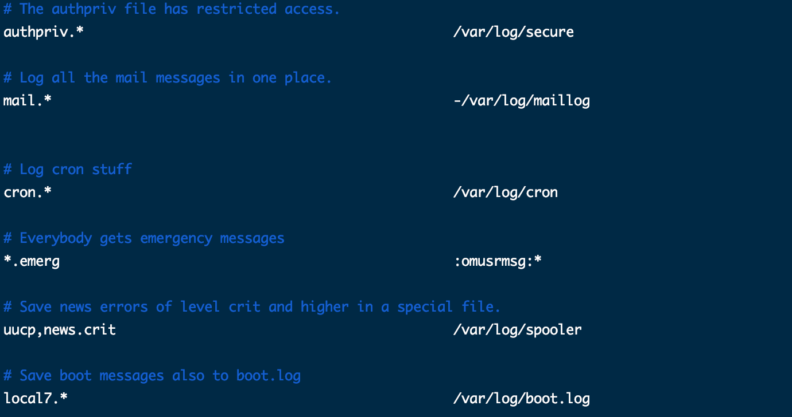

```
# 服务名称[连接符号]日志等级	日志记录位置
authpriv.*			/var/log/secure
# 日志相关的服务.所有日志等级	记录在/var/log/secure日志中
```

- **服务名称**

| 服务名称        | 说明                                                         |
| --------------- | ------------------------------------------------------------ |
| auth            | 安全和认证相关信息（不推荐使用authpriv替代）                 |
| authpriv        | 安全和认证相关信息（私有的）                                 |
| cron            | 系统定时任务cront和at产生的日志                              |
| daemon          | 和各个守护进程相关的日志                                     |
| ftp             | ftp守护进程产生的日志                                        |
| kern            | 内核产生的日志（不是用户进程产生的）                         |
| local10-local17 | 为本地使用预留的服务                                         |
| lpr             | 打印产生的日志                                               |
| mail            | 邮件收发信息                                                 |
| news            | 与新闻服务器相关的日志                                       |
| syslog          | 由syslogd服务产生的日志信息（虽然服务名称已经改为rsyslogd，但是很多配置都还是沿用了syslogd的，这里并没有修改服务名） |
| user            | 用户等级类别的日志信息                                       |
| uucp            | uucp子系统的日志信息，uucp是早起linux系统进行数据传递的协议，后来也常用在新闻组服务中 |


- **连接符号**

连接符号可以识别为：

（1）“`*`” 代表所有日志等级，比如：“`authpriv.*`”，代表authpriv认证信息服务产生的日志，所有的日志等级都记录。

（2）“`.`” 代表只要比后面的等级高的（包含该等级）日志都记录下来，比如：“cron.info”代表cron服务产生的日志，只要日志等级大于等于info级别，就记录。

（3）“`.=`” 代表只记录所需等级的日志，其他等级的都不记录。比如：“.=emerg” 代表任何日志服务产生的日志，只要等级是emerg等级就记录。这种用法极少见，了解就好。

（4）“`.!`” 代表不等于，也就是除了该等级的日志外，其他等级的日志都记录。


- 日志等级

| 等级名称 | 说明                                                         |
| -------- | ------------------------------------------------------------ |
| debug    | 一般的调试信息说明                                           |
| info     | 基本的通知信息                                               |
| notice   | 警告信息，但是有一定的重要性                                 |
| warning  | 警告信息，但是还不会影响到服务或系统的运行                   |
| err      | 错误信息，一般达到err等级的信息以已经可以影响到服务或系统的运行了 |
| crit     | 临界状况信息，比err等级还要严重                              |
| alert    | 警告状态信息，比crit还要严重，必须立即采取行动               |
| emerg    | 疼痛等级信息，系统已经无法使用了                             |
|          |                                                              |

- **日志记录位置**

```
· 日志文件的绝对路径，如"/var/log/secur"
· 系统设备文件，如"/dev/lp0"
· 转发给远程主机，如"@192.168.0.210:514"
· 用户名，如"root"
· 忽略或丢弃日志，如"~""
```

### 3. 日志轮替

1. 日志文件的命名规则

如果配置文件中拥有“dateext”参数，那么日志就会用日期来作为日志文件的后缀，例如“secure-20130605”。这样的话日志文件名不会重叠，所以也就不需要日志文件的改名，只需要保存指定的日志个数，删除多余的日志文件即可。

如果配置文件中没有“dateext”参数，那么日志文件就需要进行改名了。当第一次进行日志轮替时，当前的“secure”日志会自动改名为“secure.1”，然后新建“secure”日志，用来保存新的日志。当第二次进行日志轮替时，“secure.1”会自动改名为“secure.2”，当前的“secure”日志会自动改名为“secure.1”，然后也会新建“secure”日志，用来保存新的日志，一次类推。

2. logrotate配置文件

```
/etc/logrotate.conf
```


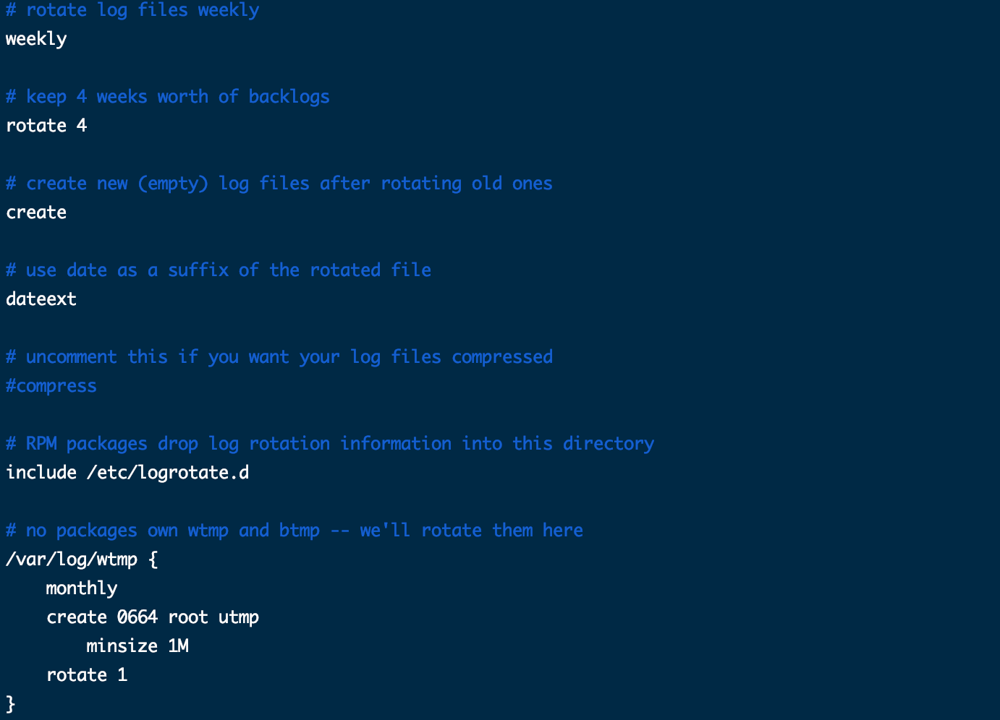

| 参数                    | 参数说明                                                     |
| ----------------------- | ------------------------------------------------------------ |
| daily                   | 日志的轮替周期是每天                                         |
| weekly                  | 日志的轮替周期是每周                                         |
| monthly                 | 日志的轮替周期是每月                                         |
| rotate 数字             | 保留的日志文件的个数。0指没有备份                            |
| compress                | 日志轮替时，旧的日志进行压缩                                 |
| create mode owner group | 新建日志组，同时指定新日志的权限和所有者和所属组。如create 0600 root utmp |
| mail address            | 当日志轮替时，输出内容通过邮件发送指定的邮件地址。如mail xxx@163.com |
| missingok               | 如果日志不存在，则忽略该日志的警告信息                       |
| notifempty              | 如果日志为空文件，则不进行日志轮替                           |
| minsize 大小            | 日志轮替的最小值，也就是日志一定要达到这个最小值才会轮替，否则就算时间达到也不轮替 |
| size 大小               | 日志只有大于指定大小才进行日志轮替，而不是按照时间轮替。如size 100k |
| dateext                 | 使用日期作为日志轮替文件的后缀。如secure-20180808            |


3. 把apache日志加入轮替

只要是RPM包安装的服务，默认支持轮替，一般只有通过源码安装包安装的服务需要手动加入日志轮替。

```
vim /etc/logrotate.conf
...
/usr/local/apache2/logs/access_log{
	daily
	create
	rotate 30
}
```

4. `logrorate`命令

```
logrotate [选项] 配置文件名
# 选项
如果此命令没有选项，则会按照配置文件中的条件进行日志轮替
-v:	显示日志轮替过程。加了-v选项，会显示日志轮替的过程
-f:	强制执行日志轮替。不管日志轮替的条件是否已经符合，强制配置文件中所有的日志进行轮替。
```

例如：

```shell
logrotate -v /etc/logrotate.conf  
```

## 十二、启动管理

### 1. 启动流程

#### 1.1 系统运行级别

1. 系统运行级别

| 运行级别 | 含义                                                      |
| -------- | --------------------------------------------------------- |
| 0        | 关机                                                      |
| 1        | 单用户模式，可以想象为windows的安全模式，主要用于系统修复 |
| 2        | 不完全的命令行模式，不含NFS服务                           |
| 3        | 完全的命令行模式，就是标准字符界面                        |
| 4        | 系统保留                                                  |
| 5        | 图形模式                                                  |
| 6        | 重启动                                                    |

2. 查询与改变系统运行级别

查询系统运行级别：

```
runlevel
```


输出格式为：上一个运行级别 当前运行级别

 上图中N 3代表刚启动就进入完全多用户模式

改变系统运行级别：

```
init 运行级别
```

3. 系统默认运行级别

```
vim /etc/inittab
# 系统开机后直接进入哪个运行级别
id:3:initdefaylt:
```

「注意」在CentOS7中，修改/etc/inittab已经不起作用了

查看默认运行级别：

```
systemctl get-default
```

修改默认运行级别：

```
systemctl set-default TARGET.target
```

有两个主要的target

```
multi-user.target  <==>  3
graphical.target   <==>  5
```

#### 1.2 系统启动过程




- **BIOS**

Basic Input Output System。它是一组固化到主板上的一个ROM芯片上的程序，是电脑启动时加载的第一个程序。包括：基本输入输出，硬件自检和系统自启动程序。

- **MBR**

Master Boot Record（主引导记录）。我们将包含MBR引导代码的的扇区称为主引导扇区，共512字节，习惯上称为MBR扇区。主引导扇区由三个部分组成：

```
主引导程序，即主引导记录(MBR，占用446个字节: 它用于硬盘启动时将系统控制转交给用户指定的在分区表中登记了的某个操作系统。
磁盘分区表项（占用16个字节: 负责说明磁盘上的分区情况。
结束标志——占用2个字节
```

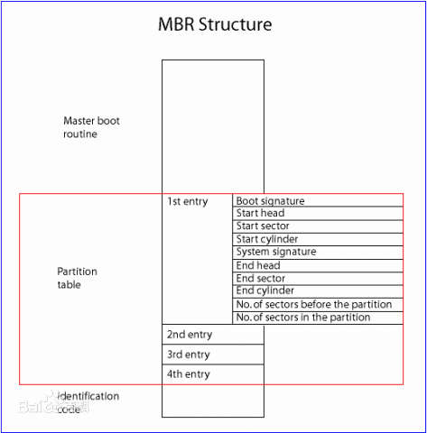

硬盘的主引导记录不属于任何一个操作系统，它先于操作系统被调用内存并发挥作用，然后将控制权交给主分区（活动分区）内的操作系统，并用主分区信息表来管理硬盘。


- **`initramfs`内存文件系统**

该文件可以通过启动引导程序加载到内存中，然后加载启动过程中所需要的内核模块，比如USB、SATA、SCSI、硬盘的驱动和LVM、RAID文件系统的驱动

```
存放位置：/boot/
作用：因为系统的驱动放在/lib/目录下，但是没有驱动就无法识别系统硬盘读出该目录，于是通过initramfs建立了一个仿真的根目录，里面含有所需的驱动，就可以打开/lib/
```

```bash
# 建立测试目录
mkdir /tmp/initramfs
# 复制initramfs文件
cp /boot/initramfs-3.10.0-514.el7.x86_64kdump.img /tmp/initramfs/
cd /tmp/initramfs/
file initramfs-3.10.0-514.el7.x86_64kdump.img
# 修改文件的后缀名为.gz
mv initramfs-3.10.0-514.el7.x86_64kdump.img initramfs-3.10.0-514.el7.x86_64kdump.img.gz
# 解压缩
gunzip initramfs-3.10.0-514.el7.x86_64kdump.img.gz
# 解压缩
cpio -ivcdu < initramfs-3.10.0-514.el7.x86_64kdump.img
```

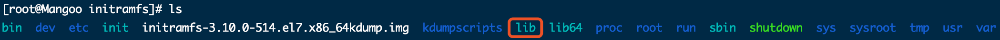

上面的实验模拟了一个仿真根文件系统。


- **调用/etc/init/rcS.conf配置文件**

主要功能有两个：

（1）先调用/etc/rc.d/rc.sysinit，然后/etc/rc.d/sysinit配置文件进行Linux系统初始化。

（2）然后调用/etc/inittab，由inittab配置文件确定系统的默认运行级别。 


- **由/etc/rc.d/rc.sysinit初始化**

（1）获得网络环境

（2）挂载设备

（3）开机启动画面Plymouth（取代了过往的RHGB）

（4）判断是否启用SELinux

（5）显示开机过程中的开机画面

（6）初始化硬件

（7）用户自定义模块的加载

（8）配置内核的参数

（9）设置主机名

（10）同步存储器

（11）设备映射器及相关的初始化

（12）初始化软件磁盘阵列

（13）初始化LVM的文件系统功能

（14）检验磁盘文件系统

（15）设置磁盘配额（quota）

（16）重新以可读写模式挂载系统磁盘

（17）更新quota（非必要）

（18）启动系统虚拟随机数生成器

（19）配置机器（非必要）

（20）清除开机过程当中的临时文件

（21）创建ICE目录

（22）启动交换分区（swap）

（23）将开机信息写入/var/log/dmesg文件中


- **调用/etc/rc.d/rc文件**

运行级别参数传入/etc/rc.d/rc这个脚本之后，由这个脚本文件按照不同的运行级别启动/etc/rc[0-6].d/目录中相应的程序。

```
/etc/rc3.d/K??开头的文件(??是数字)，会按照数字顺序依次关闭
/etc/rc3.d/S??开头的文件(??是数字)，会按照数字顺次以此启动
```

## 2. 启动引导程序

#### 2.1 Grub配置文件

1. grub中分区表示

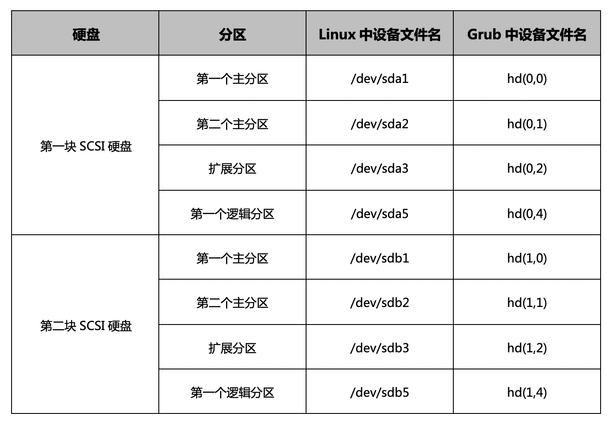

2. /boot/grub/grub.conf

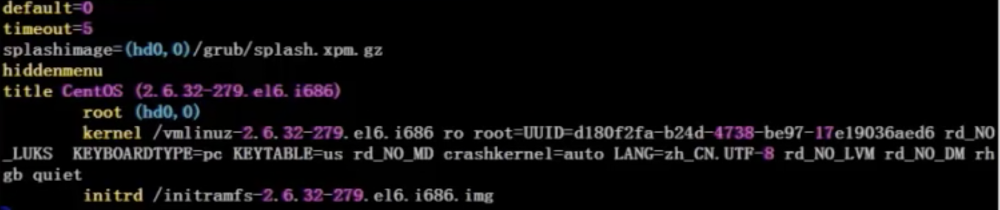

```
vim /boot/grub/grub.conf
..
# 默认启动第一个系统
default=0
# 等待时间，默认是5S
timeout=5
# 这里是指顶grub启动时的背景图像文件的保存位置
spalishimage=(hd0,0)/grub/splash.xpm.gz
# 隐藏菜单
hiddenmunue
# 标题
title CentOS(2.6.32-279.el6.i686)
#指启动程序的保存分区
root(hd0,0)
# 定义内核加载时的选项
kernel /vmliuz-2.6.32-279.el6.i686 r...
...
# 制定了initramfs内存文件系统镜像文件所在的位置
initrd /initramfs-2.6.32-279.el6.i686.img
```

如果更新了内核，没有覆盖原来的内核，启动时就会两个都可以选，也就是/boot/grub/grub.conf里面后面再多四行。服务器上不要随便乱升级。

#### 2.2 Grub加密与字符界面分辨率调整

1. grub加密

```
# 生成加密密码串
grub-md5-crypt
```

拷贝生成的密码串：

```
vi /boot/grub/grub.conf
...
default=0
timeout=5
# password选项放在整体设置处
password --md5 XXXXXXXXXXXXXXXXXXXXXXX(生成的密码串)
spalishimage=(hd0,0)/grub/splash.xpm.gz
hiddenmunue
...
```

启动系统时，按下p，输入正确的密码才能进入Grub编辑模式。

2. 字符界面分辨率调整

```
vim /boot/grub/grub.conf
...
kernel ... vga=791
...
```

| 色深 | 640*480 | 800*600 | 1024*768 | 1280*1024 |
| ---- | ------- | ------- | -------- | --------- |
| 8位  | 769     | 771     | 773      | 775       |
| 15位 | 784     | 787     | 790      | 793       |
| 16位 | 785     | 788     | 791      | 794       |
| 32位 | 786     | 789     | 792      | 795       |

## 十三、备份与恢复

### 1. 概述

1. Linux系统需要备份的数据

```
/root/目录:
/home/目录:
/var/spool/mail目录:
/etc/目录:
其他目录:
```

2. 安装服务的数据

apache需要备份的数据

```
配置文件
网页主目录
日志文件
```

mysql需要备份的数据

```
源码包安装的mysql: /usr/local/mysql/data/
RPM包安装的mysql: /var/lib/mysql/
```

3. 备份策略

**完全备份**：完全备份就是指把所有需要备份的数据全部备份，当然完全备份可以备份整块硬盘，整个分区或某个具体的目录

**增量备份**：第一天完全备份

​					第二天备份新增数据 

​					…  

​					第n天备份新增数据

​					<每次备份都跟上一次备份相比>

**差异备份**：第一天完全备份

​					第二天备份新增数据

​					第三天备份第二天+第三天数据

​					...

​					第n天备份第二天到第n天数据

​					<每次备份都只跟完全备份相比>

### 2. `dump`和`restore`

1. dump命令

```
dump [选项] 备份之后的文件名 元文件或目录
# 选项:
	-level:	0-9十个备份级别
	-f:		文件名
	-u:		备份成功之后，把备份时间记录在/etc/dumpdates文件
	-v:		显示备份过程中更多的输出信息
	-j:		调用bzlib库压缩备份文件，其实就是把备份文件压缩为.bz2格式
	-W:		显示允许被dump的分区的备份等级及备份时间
```

例如：备份分区

```
# 备份命令，先执行一次完整备份，并压缩和更新备份时间
dump -0uj -f /root/boot.bak.bz2 /boot/
# 查看备份时间文件
cat /etc/dumpdates
# 复制日志文件到/boot/分区
cp install.log /boot/
# 增量备份/boot分区
dump -1uj -f /root/boot.bak1.bz2 /boot
# 查询分区的备份时间及备份级别
dump -W
```

例如：备份文件或目录

```shell
# 完全备份/etc/目录,只能使用0级别进行完全备份，而不再支持增量备份
dump -0j -f /root/etc.dump.bz2 /etc/
```

「注意：」文件或目录只支持完全备份（0级别），不支持增量备份。


2. restore命令

```
restore [模式选项] [选项]
# 模式选项:restore命令常用的模式有以下四种，这四个模式不能混用。
	-C:	比较备份数据和实际数据的变化
	-i:	进入交互模式，手工选择需要恢复的文件
	-t:	查看模式，用于查看备份文件中拥有哪些数据。
	-r:	还原模式，用于数据还原
	-f:	指定备份文件的文件名
```

例1：比较备份数据和实际数据的变化

```shell
# 把/boot目录中内核镜像文件改个名字
mv /boot/vmlinuz-2.6.32-279.el6.i686 /boot/vmlinuz-2.6.32-279.el6.i686.bak
# 发现内核镜像文件丢失
restore -C -f /root/boot.bak.bz2
```

例2：查看模式

```shell
restore -t -f book.bak.bz2
```

例3：还原模式

```shell
# 还原boot.bak.bz2分区备份
# 先还原完全备份的数据
mkdir boot.test
cd boot.test
restore -r -f /root/boot.bak.bz2
# 恢复增量备份数据
restore -r -f /root/boot.bak1.bz2
```

 